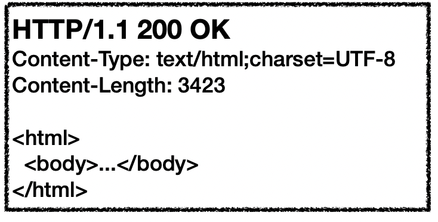

## 모든 것이 HTTP

------

### HTTP(HyperText Transfer Protocol)

**HTTP를 통한 전송**

- HTML, TEXT 
- IMAGE, 음성, 영상, 파일 
- JSON, XML (API) 
- 거의 모든 형태의 데이터 전송 가능
- 서버간에 데이터를 주고 받을 때도 대부분 HTTP 사용

**HTTP의 역사**

- HTTP/0.9 1991년: GET 메서드만 지원, HTTP 헤더X
- HTTP/1.0 1996년: 메서드, 헤더 추가 
- **HTTP/1.1 1997년: 가장 많이 사용, 우리에게 가장 중요한 버전**
  - RFC2068 (1997) -> RFC2616 (1999) -> RFC7230~7235 (2014)
- HTTP/2 2015년: 성능 개선
- HTTP/3 진행중: TCP 대신에 UDP 사용, 성능 개선

**기반 프로토콜**

- TCP : HTTP/1.1, HTTP/2
- UDP : HTTP/3
- 현재 HTTP/1.1 주로 사용
  - HTTP/2, HTTP/3도 점점 증가

**HTTP의 특징**

- 클라이언트 서버 구조
- 무상태 프로토콜(스테이스리스), 비연결성
- HTTP 메세지
- 단순함, 확장 가능

## 클라이언트 서버 구조

------

- Request Response 구조
- 클라이언트는 서버에 요청을 보내고 응답 대기
- 서버는 요청에 대한 결과를 만들어서 응답

> 서버에는 데이터, 비즈니스 로직, 클라이언트에는 UI, 사용성에 집중을 하여 클라이언트와 서버의 독립적인 진화 가능

## 무상태 프로토콜

------

### 스테이스리스(Stateless)

- 서버가 클라이언트 상태를 보존 X
- 장점 : 서버 확장성 높음(스케일 아웃)
- 단점 : 클라이언트가 추가 데이터 전송

### Stateful, Stateless 차이

- **스테이스풀(Stateful)**

  고객 : 이 **노트북** 얼마인가요?	점원 : 100만원입니다. (노트북 상태 유지)

  고객 : **2개** 구매하겠습니다.	점원 : 200만원입니다. 무엇으로 결제 하시겠어요? (노트북, 2개 상태 유지)

  고객 : **신용카드**로 구매하겠습니다. 	200만원 결제 완료 되었습니다. (노트북, 2개, 신용카드 상태 유지)

- **스테이스리스(Stateless)**

  고객 : 이 **노트북** 얼마인가요?	점원 : 100만원입니다.

  고객 : **노트북 2개** 구매하겠습니다. 노트북 2개는 200만원입니다. 무엇으로 결제 하시겠어요?

  고객 : **노트북** **2개**를 **신용카드**로 구매하겠습니다. 200만원 결제 완료되었습니다.

**차이점**

- Stateful : 중간에 다른 점원으로 바뀌면 안된다. (중간에 점원 변경 시 다른 점원에게 상태 정보를 미리 알려줘야 함)
- Stateless : 중간에 다른 점원으로 바뀌어도 된다.
  - 갑자기 클라이언트(고객) 요청이 증가해도 서버(점원)를 대거 투입할 수 있다. 
  - 무상태는 응답 서버를 쉽게 바꿀 수 있다. -> 무한한 서버 증설 가능 / 서버 장애 시 다른 서버로 변경 가능

**Stateless의 실무 한계**

- 모든 것을 무상태로 설계할 수 있는 경우도 있고 없는 경우도 있다.
- 무상태
  - 예시 : 로그인이 필요 없는 단순한 서비스 소개 화면
- 상태 유지
  - 예시 : 로그인
- 로그인한 사용자의 경우 로그인 했다는 상태를 서버에 유지
- 일반적으로 브라우저 쿠키와 서버 세션등을 사용해서 상태 유지
- 상태 유지는 최소한만 사용

## 비연결성

------

### 비연결성

- HTTP는 기본이 연결을 유지하지 않는 모델
- 일반적으로 초 단위 이하의 빠른 속도로 응답
- 1시간 동안 수천명이 서비스를 사용해도 실제 서버에서 동시에 처리하는 요청은 수십개 이하
  - 예시 : 웹 브라우저에서 계속 연속해서 검색 버튼을 누르지는 않는다.

- 서버 자원을 효율적으로 사용 가능

**한계와 극복**

- TCP/IP 연결을 새로 맺어야 함 = 3 way handshake 시간 추가
- 웹 브라우저로 사이트를 요청하면 HTML 뿐만 아니라 자바스크립트, css, 추가 이미지 등 수 많은 자원이 함께 다운로드
- 지금은 HTTP 지속 연결(Presstent Connections)로 문제 해결
- HTTP/2, HTTP/3에서 더 많은 최적화

HTTP 초기 - 연결, 종료, 낭비

   

HTTP 지속 연결

   

## HTTP 메세지

------

#### 요청 메세지

   

- **start-line**

  - request-line / status-line

    - **request-line**

      method SP(공백) request-target SP HTTP-version CRLF(엔터)

    - **method**

      - 종류 : GET, POST, PUT, DELETE
      - 서버가 수행해야 할 동작 지정
        - GET : 리소스 조회
        - POST : 요청 내역 처리

    - **request-target**

      - absolute-path[?query] (절대경로[?쿼리])
      - 절대경로="/"로 시작하는 경로
      - 참고 : *, http://...?x=y와 같이 다른 유형의 경로지정 방법도 있다.

    - **http-version**

#### 응답 메세지

   

- **start-line**
  - request-line / **status-line**
  - **status-line**
    - HTTP-version SP status-code SP reason-phrase CRLF
    - **HTTP-version**
    - **status-code**
      - 요청 실패를 나타냄
      - 200: 성공 / 400: 클라이언트 요청 오류/ 500: 서버 내부 오류
    - **reason-phrase**
      - 사람이 이해할 수 있는 짧은 상태 코드 설명 글

### HTTP 헤더

- header-field = field-name ":" OWS field-value OWS (OWS : 띄어쓰기 허용)
- field-name은 대소문자 구분 없음

**용도**

- HTTP 전송에 필요한 부가정보
- 예시 : 메세지 바디의 내용, 메세지 바디의 크기, 압축, 인증, 요청 클라이언트(브라우저 정보) 등
- 표준 헤더가 너무 많음
- 필요시 임의의 헤더 추가 가능
  - helloWorld: hihi

### HTTP 바디

- 실제 전송할 데이터
- HTML 문서, 이미지, 동영상, JSON 등 byte로 표현할 수 있는 모든 데이터 전송 가능