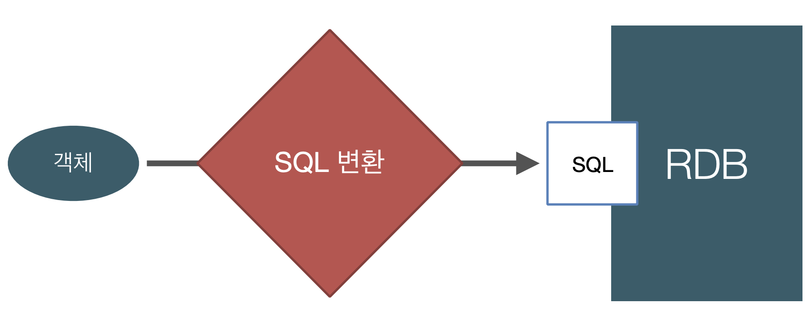
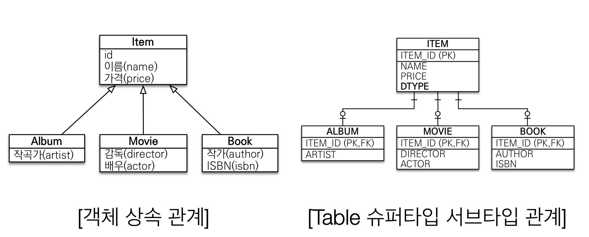
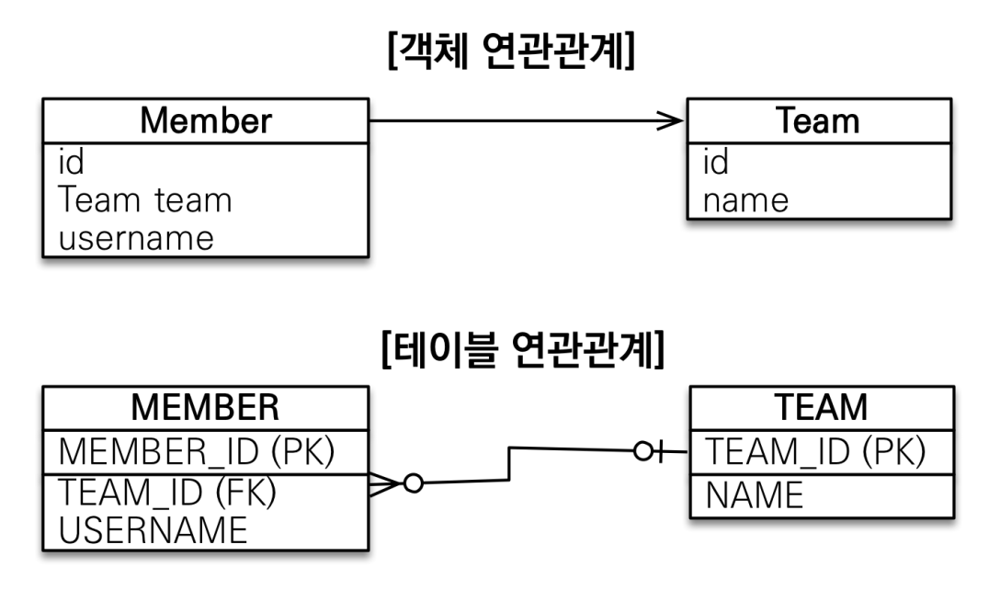
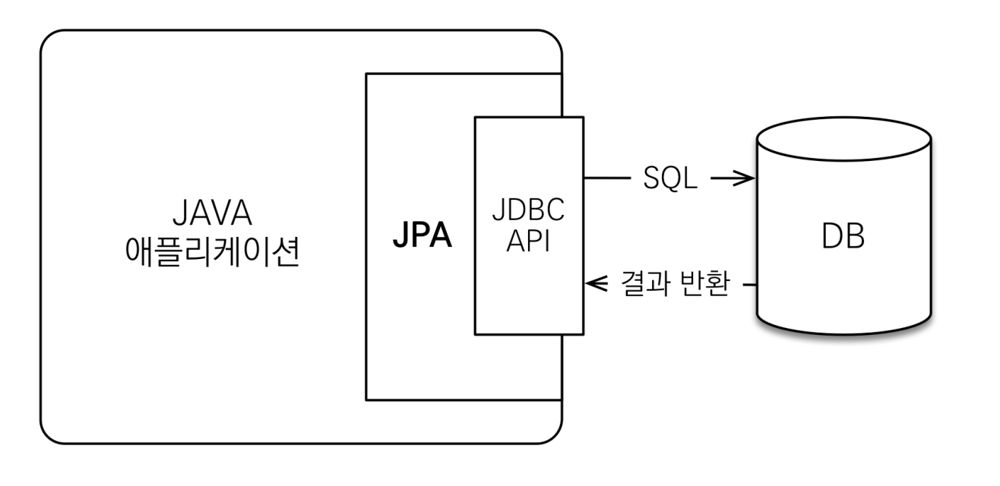
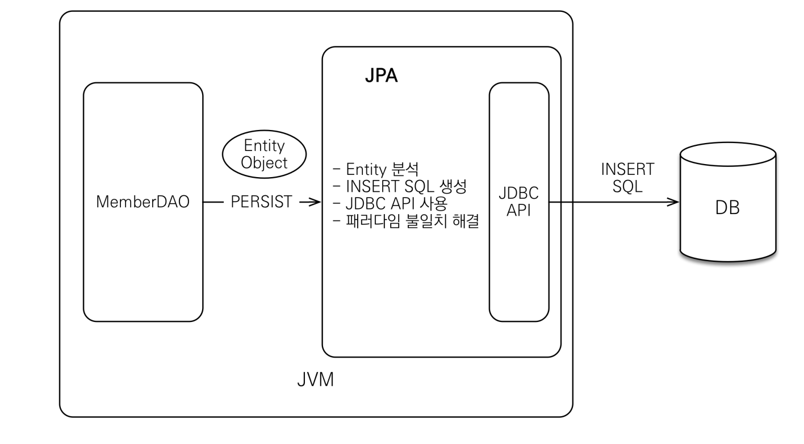
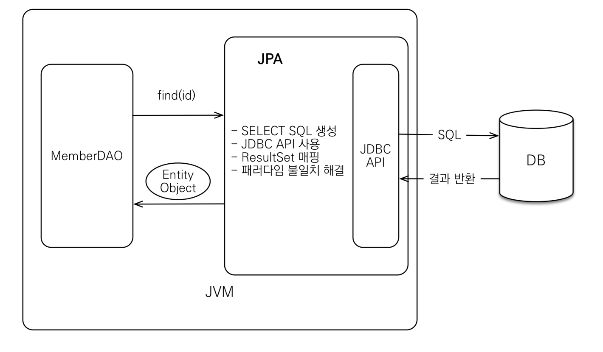

지금 시대는 객체를 관계형 DB에 관리한다.

SQL 중심적인 개발의 문제점

- 무한 반복 & 지루한 코드
  
  - 객체 CURD에 필드를 추가할 경우 해당 객체의 모든 쿼리문에 필드를 추가해야함
    
    -> 놓치는 경우 발생

- 패러다임의 불일치

- **객체 지향 프로그래밍**은 추상화, 캡슐화 정보은닉, 상속, 다형성 등 시스템의 복잡성을 제어할 수 있는 다양한 장치 제공

- 객체를 영구 보관하는 저장소 중 현실적인 대안은 RDBMS



- 객체답게 모델링 할 수록 매핑 작업 증가

- 객체와 관계형 DB의 차이
  
  1. 상속
     
     
     
     - 위의 관계에서 Album을 저장할 경우 insert 문 2번 작성 필요(Item table, Album table)
     - Album을 조회할 경우 각 테이블에 따른 Join SQL 작성 -> 각각 객체 생성 ...
  
  2. 연관관계
     
     
     
     - 객체는 참조 이용 : member.getTeam()
     - 테이블은 외래 키 이용 : JOIN ON M.TEAM_ID = T.TEAM_ID
  
  3. 데이터 타입
  
  4. 데이터 식별 방법
     
     - 엔티티 신뢰 문제 발생
       
       ```java
       class MemberService {
         public void process() {
           // memberDAO를 직접 보지 않으면 신뢰 불가
           Member member = memberDAO.find(memberId);
           member.getTeam(); // ??? 
           member.getOrder.getDelivery(); // ???
         }
       }
       ```

## JPA 소개

---

JPA

- Java Persistence API
- 자바 진영의 ORM 표준 기술

ORM

- Object-relational mapping(객체 관계 매핑)
- 객체는 객체 대로, 관계형 데이터베이스는 관계형 데이터베이스 대로 설계
- ORM 프레임워크가 중간에서 매핑
- 대중적인 언어에는 대부분 ORM 기술 존재

jpa는 애플리케이션과 JDBC 사이에서 동작



JPA 동작 - 저장



JPA 동작 - 조회



- JPA는 인터페이스의 모음

- JPA 2.1 표준 명세를 구현한 3가지 구현체
  
  - Hibernate(8~90%)
  
  - EclipseLink
  
  - DataNucleus

-  JPA 버전
  
  - JPA 1.0(JSR 220) 2006년 : 초기 버전, 복합 키와 연관관계 기능 부족
  
  - JPA 2.0(JSR317) 2009년 : 대부분의 ORM 기능을 포함, JPA Criteria 추가
  
  - JPA 2.1(JSR 338) 2013년 : 스토어드 프로시저 접근, 컨버터, 엔티티 그래프 기능 추가

JPA 사용 이유

-  SQL 중심적인 개발에서 객체 중심으로 개발

- 생산성
  
  - JPA CRUD
    
    - `저장: jpa.persist(member)
    
    - 조회: Member member = jpa.find(memberId)
    
    - 수정: member.setName("변경할 이름")
    
    - 삭제: jpa.remove(member)

- 유지보수
  
  - 기존: 필드 변경시 모든 SQL 수정 필요
  
  - JPA: 필드만 추가하면 됨. SQL은 JPA가 처리

- 패러다임의 불일치 해결
  
  - JPA 상속
  
    
  
    - 저장
      
      - 개발자의 코드
      
      - ```java
        jpa.persist(album);
        ```
      
      - 나머지는 JPA가 처리
        
      - ```sql
        INSERT INTO ITEM ...
        INSERT INTO ALBUM ...
        ```
      
    - 조회
      
      - 개발자의 코드
      
      - ```java
        Album album = jpa.find(Album.class, albumId);
        ```
      
      - 나머지는 JPA가 처리
      
      - ```sql
        SELECT I.*, A.*
        	FROM ITEM I
        	JOIN ALBUM A ON I.ITEM_ID = A.ITEM_ID
        ```
  
  - JPA와 연관관계, 객체 그래프 탐색
  
    - 연관관계 저장
  
      - ```
        member.setTeam(team);
        jpa.persist(member);
        ```
  
    - 객체 그래프 탐색
  
      - ```
        Member member = jpa.find(Member.class, memberId);
        Team team = member.getTeam();
        ```
  
        
  
  - JPA와 비교하기
  
    - ```java
      String memberId = "100";
      Member member1 = jpa.find(Member.class, memberId);
      Member member2 = jpa.find(Member.class, memberId);
      
      member == member2; //true
      ```
  
      동일한 트랜잭션에서 조회한 엔티티는 같음을 보장
  
- 성능 최적화 기능

  - 1차 캐시와 동일성 보장

    - 같은 트랜잭션 안에서는 같은 엔티티를 반환 - 약간의 조회 성능 향상

    - DB Isolation Level이 Read Commit이어도 애플리케이션에서 Repeatable Read 보장

    - ```java
      String memberId = "100";
      Member m1 = jpa.find(Member.class, memberId); //SQL
      Member m2 = jpa.find(Member.class, memberId); //캐시
      
      println(m1==m2) //true
      ```

  - 트랜잭션을 지원하는 쓰기 지연

    - INSERT

      - 트랜잭션을 커밋할 때까지 Insert SQL을 모아서 JDBC BATCH SQL 기능을 사용해 한 번에 SQL 전송

      - ```
        transaction.begin(); // 트랜잭션 시작
        em.persist(memberA);
        em.persist(memberB);
        em.persist(memberC);
        //커밋하는 순간 데이터베이스에 INSERT SQL을 모아서 한번에 보냄.
        transaction.commit(); //트랜잭션 커밋
        ```

  - 지연 로딩

    - 지연 로딩: 객체가 실제 사용될 때 로딩

      ```
      Member member = memberDAO.find(memberId); // select * from Member
      Team team = member.getTeam();
      String teamName = team.getName(); // select * from team, 필요할 때마다 쿼리를 나눠서 실행
      ```

    - 즉시 로딩: JOIN SQL로 한 번에 연관된 객체까지 미리 조회

      ```
      Member member = memberDAO.find(memberId);
      Team team = member.getTeam();
      String teamName = team.getName(); // -> select M.*, T.* from MEMBER JOIN TEAM ..., 한 번에 쿼리 실행
      ```

      