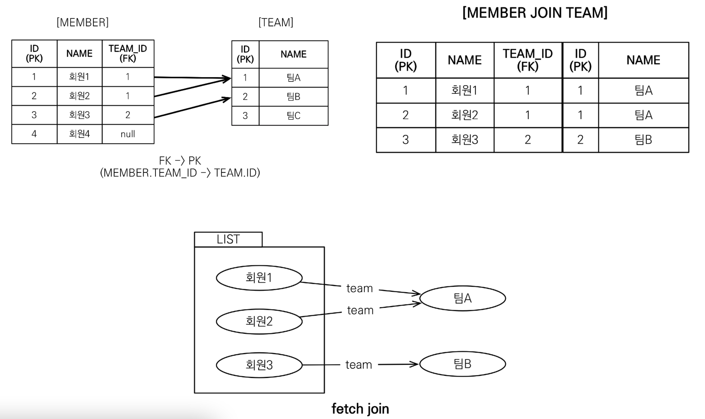
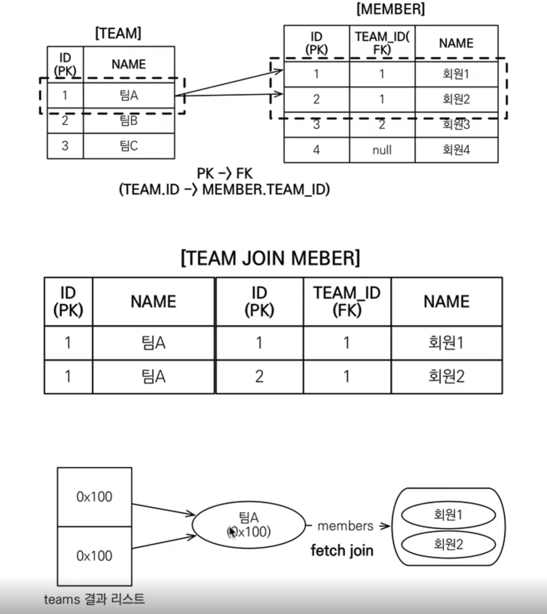
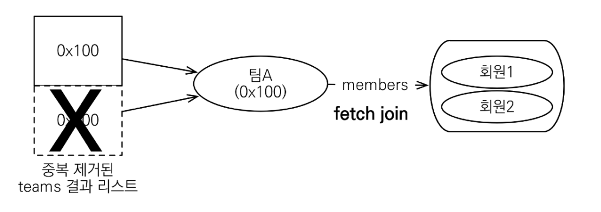

# 객체지향 쿼리 언어2 - 중급문법


## 경로 표현식

#### 경로 표현식이란

> .(점)을 찍어 객체 그래프를 탐색하는 것

- 상태 필드(state field): 단순히 값을 저장하기 위한 필드. 경로 탐색의 끝, 탐색 X

  ```sql
  select m.username # -> 상태 필드
  ```

- 연관 필드(association field): 연관관계를 위한 필드

  - 단일 값 연관 필드: @ManyToOne, @OneToOne, 대상이 엔티티. 묵시적 내부 조인 발생, 탐색 O

    - 예시: m.team

      ```sql
      # JPQL
      select o.member from Order o
      
      #SQL
      select m.* from Orders o inner join Member m on o.member_id=m.id
      ```
  
  - 컬렉션 값 연관 필드: @OneToMany, @ManyToMany, 대상이 컬렉션. 묵시적 내부 조인 발생, 탐색 X

    - 예시: m.orders
  
    - FROM 절에서 명시적 조인을 통해 별칭을 얻으면 별칭을 통해 탐색 가능
  
      ```sql
      select m.username from Team t join t.members m
      ```
  

#### 명시적 조인, 묵시적 조인

- 명시적 조인: join 키워드 직접 사용

  ```sql
  select m fro Member m join m.team t
  ```

- 묵시적 조인: 경로 표현식에 의해 묵시적으로 SQL 조인 발생(내부 조인만 가능)

  ```sql
  select m.team from Member m
  ```

#### 경로 표현식 - 예제

```sql
select o.member.team from Order o # 성공
```

```sql
select t.members from Team # 성공
```

```sql
select t.members.username from Team t # 실패 (컬렉션에선 추가로 필드 출력 불가)
```

```sql
select m.username from Team t join t.members m # 성공 (컬렉션을 명시적 조인을 이용하여 객체 m을 이용한 출력)
```


#### 경로 탐색을 사용한 묵시적 조인 시 주의사항

- 항상 내부 조인
- 컬렉션은 경로 탐색의 끝, 명시적 조인을 통해 별칭을 얻어야 함
- 경로 탐색은 주로 SELECT, WHERE 절에서 사용하지만 묵시적 조인으로 인해 SQL의 FROM(JOIN) 절에 영향을 줌
- **가급적 묵시적 조인 대신 명시적 조인 사용**
- 조인은 SQL 튜닝에 중요 포인트이고, 묵시적 조인은 조인이 일어나는 상황을 파악하기 어려움


## 페치 조인 1 - 기본


### 페치 조인(fetch join)

- SQL 조인 종류 X
- JPQL에서 성능 최적화를 위해 제공하는 기능
- 연관된 엔티티나 컬렉션을 SQL 한 번에 함께 조회하는 기능
- join fetch 명령어 사용
- 페치 조인 ::= [LEFT[OUTER]|INNER] JOIN FETCH 조인경로



#### 엔티티 페치 조인

- 회원을 조회 하면서 연관된 팀도 함께 조회(SQL 한 번에)

- SQL에 회원 뿐만 아니라 팀(T.*)도 함께 SELECT

- [JPQL]

  ```java
  select m from Member m join fetch m.team
  ```

- [SQL]

  ```sql
  SELECT M.*, T.* FROM Member M INNER JOIN Team T ON M.Team_ID=T.ID
  ```

#### 페치 조인 사용 코드

```java
String jpql = "select m From Member m join fetch m.team";
List<Member> members = em.createQuery(jpql, Member.class)
  .getResultList();
for (Member member : members) {
  // 페치 조인으로 회원과 팀을 함께 조회해서 지연 로딩X
  System.out.println("username : " + member.getUsername() + "," + "teamName : " + member.getTeam().getName());
}

// 결과 (FETCH JOIN 사용 X)
// username : 회원1,teamName : 팀A	// SQL 발생(영속성 컨텍스트에 팀A 정보 X)
// username : 회원2,teamName : 팀B	// SQL 발생(영속성 컨텍스트에 팀B 정보 X)
// username : 회원3,teamName : 팀B	// 1차캐시(회원2 호출 시점에 영속성 컨텍스트에 팀B 적재)

// 결과 (FETCH JOIN 사용)
// username : 회원1,teamName : 팀A	
// username : 회원2,teamName : 팀B	
// username : 회원3,teamName : 팀B
// QUERY 생성 시점에서 전체 데이터 불러옴
```

#### 컬렉션 페치 조인

- 일대다 관계, 컬렉션 페치 조인

- [JPQL]

  ```java
  select t
  from Team t join fetch t.members
  where t.name='팀A'
  ```

- [SQL]

  ```sql
  SELECT T.*, M.*
  FROM Team T
  INNER JOIN Member M ON T.ID = M.TEAM_ID
  WHERE T.name='팀A'
  ```

  

#### 페치 조인과 DISTINCT

- SQL의 DISTINCT는 중복된 결과를 제거하는 명령
- JPQL의 DISTINCT는 2가지 기능 제공
  - SQL에 DISTINCT 추가
  - 애플리케이션에서 엔티티 중복 제거

```sql
select distinct t from Team t join fetch t.members where t.name = '팀A'
// SQL에 DISTINCT를 추가하지만 데이터가 다르기 때문에 중복제거 실패
```

- DISTINCT가 추가로 애플리케이션에서 중복 제거시도
- 같은 식별자를 가진 Team 엔티티 제거



#### 페치 조인과 일반 조인 차이

- JPQL은 결과를 반환할 때 연관관계 고려 X(SELECT 절에 지정한 엔티티만 조회)
- 위 예시의 경우 팀 엔티티만 조회하고 멤버 엔티티 조회 X
- 페치 조인을 사용할 때만 연관된 엔티티도 함게 조회(즉시 로딩)
- 페치 조인은 객체 그래프를 SQL 한 번에 조회하는 개념


## 페치 조인 2 - 한계

#### 페치 조인의 한계

- 페치 조인 대상에는 별칭을 줄 수 없다.(하이버네이트는 가능하지만 가급적 사용 X)
- 둘 이상의 컬렉션은 페치 조인 불가능
- 컬렉션을 페치 조인하면 페이징 API(setFirstResult / setMaxResults) 사용 불가능
- 일대일, 다대일 같은 단일 값 연관 필드들은 페치 조인을 해도 페이징이 가능
- 하이버네이트는 경고 로그를 남기고 메모리에서 페이징(매우 위험)

#### 페치 조인의 특징

- 연관된 엔티티들을 SQL 한 번으로 조회 - 성능 최적화
- 엔티티에 직접 적용하는 글로벌 로딩 전략보다 우선함
  - @OneToMany(fetch = FetchType.LAZY) // 글로벌 로딩 전략
- 실무에서 글로벌 로딩 전략은 모두 지연 로딩(LAZY)
- 최적화가 필요한 곳은 페치 조인 적용

#### n+1 쿼리 문제

```java
String query = "select t From Team t";
List<Team> result = em.createQuery(query, Team.class)
  .setFirstResult(0)
  .setMaxResults(2)
  .getResultList();

for (Team team : result) {
  // 멤버를 사용할 때마다 쿼리문 발생 -> n(멤버 객체 개수) + 1만큼 쿼리 발생
  for (Member member : team.getMembers) {
    System.out.println("member : " + member);
  }
}

// 해결 방법
// 1. fetch join 사용 -> 컬렉션일 경우 사용 불가
// 2. @BatchSize(size = ??) 사용 -> 쿼리 발생 -> 테이블 수만큼 발생
// 2-1. 글로벌 세팅 persistence.xml -> <property name="hibernate.default_batch_fetch_size" value="??"/>
```

#### 페치 조인 - 정리

- 모든 것을 페치 조인으로 해결하는 건 불가능
- 페치 조인은 그래프를 유지할 때 사용하면 효과적
- 여러 테이블을 조인하여 엔티티가 가진 모양이 아닌 전혀 다른 결과를 내야할 경우 페치 조인 보단 일반 조인을 활용하여 필요한 데이터만 DTO로 반환하는 것이 효과적


## 다형성 쿼리

#### Type

- 조회 대상을 특정 자식으로 한정

- 예시: Item 중에 Book, Movie를 조회해라

- [JPQL]

  ```java
  select i from Item i where type(i) IN (Book, Movie)
  ```

- [SQL]

  ```sql
  select i from i where i.DTYPE in ('B', 'M');
  ```


#### TREAT

- 자바의 타입 캐스팅과 유사

- 상속 구조에서 부모 타입을 특정 자식 타입으로 변경시 사용

- FROM, WHERE, SELECT(하이버네이트 지원) 사용

- 예시: 부모인 Item과 자식 Book이 있다.

- [JPQL]

  ```java
  select i from Item i where treat(i as Book).auther = 'kim'
  ```

- [SQL]

  ```sql
  select i.* from Item i where i.DTYPE = 'B' and i.auther = 'kim'
  ```

  

## 엔티티 직접 사용

#### 엔티티 직접 사용 - 기본 키 값

- JPQL에서 엔티티를 직접 사용하면 SQL에서 해당 엔티티의 기본 키 값 사용

- [JPQL]

  ```java
  select count(m.id) from Member m // 엔티티의 아이디를 사용
  select count(m) from Member m // 엔티티 직접 사용
  ```

- [SQL] (JPQL 둘 다 같은 다음 SQL 사용)

  ```sql
  select count(m.id) as cnt from Member m
  ```

- 엔티티를 파라미터로 전달

  ```java
  String jpql = "select m from Member m where m = :member";
  List resultList = em.createQuery(jpql)
    										.setParameter("member", member)
    										.getResultList();
  ```

- 식별자를 직접 전달

  ```java
  String jpql = "select m from Member m where m = :memberId";
  List resultList = em.createQuery(jpql)
    										.setParameter("memberId", memberId)
    										.getResultList();
  ```

- 실행된 SQL

  ```sql
  select m.* from Member m where m.id=?
  ```

  

#### 엔티티 직접 사용 - 외래 키 값

```java
Team team = em.find(Team.class, 1L);

String qlString = "select m from Member m where m.team = :team";
List resultList = em.createQuery(qlString)
											.setParameter("team", team)
											.getResultList();
```

```java
String qlString = "select m from Member m where m.team.id = :teamId";
List resultList = em.createQuery(qlString)
											.setParameter("teamId", teamId)
											.getResultList();
```

- 실행된 SQL

  ```sql
  select m.* from Member m where m.team_id=?
  ```


## Named 쿼리

#### Named 쿼리 - 정적 쿼리

- 미리 정의해서 이름을 부여해두고 사용하는 JPQL
- 정적 쿼리
- 어노테이션, XML에서 정의
- 애플리케이션 로딩 시점에 초기화 후 재사용
- **애플리케이션 로딩 시점에 쿼리를 검증**
- Named 쿼리 환경에 따른 설정
  - XML이 항상 우선권을 가진다
  - 애플리케이션 운영 환경에 따라 다른 XML을 배포할 수 있다.
- @Query 어노테이션도 Named 쿼리의 일종(이름 없는 named 쿼리)

**Named 쿼리 - 어노테이션**

```java
// 쿼리 name 부여
@Entity
@NamedQuery(
  name = "Member.findByUserName",
  query = "select m from Member m where m.username = :username")
public class Member {
  ...
}

// named 쿼리 사용
List<Member> resultList = 
  em.createNamedQuery("Member.findByUserName", Member.class)
  	.setParameter("username", "회원1")
  	.getResultList();
```

**Named 쿼리 - XML에 정의**

[META-INF/persistence.xml]

```xml
<persistence-unit name="jpabook" >
 <mapping-file>META-INF/ormMember.xml</mapping-file>
```

[META-INF/ormMember.xml]

```xml
<?xml version="1.0" encoding="UTF-8"?>
<entity-mappings xmlns="http://xmlns.jcp.org/xml/ns/persistence/orm" version="2.1">
  <named-query name="Member.findByUsername">
    <query><![CDATA[
			select m
			from Member m
			where m.username = :username
		]]></query>
  </named-query>
  <named-query name="Member.count">
    <query>select count(m) from Member m</query>
  </named-query>
</entity-mappings>
```


## 벌크 연산

#### 벌크 연산

- 재고가 10개 미만인 모든 상품의 가격을 10% 상승하려면?

- JPQL 변경 감지 기능으로 실행하려면 너무 많은 SQL 실행

  1. 재고가 10개 미만인 상품을 리스트로 조회

  2. 상품 엔티티의 가격을 10% 증가
  3. 트랜잭션 커밋 시점에 변경감지 동작

- 변경 데이터가 n건이면 n건의 UPDATE SQL 실행


#### 벌크 연산 예제

- 쿼리 한 번으로 여러 테이블 로우 변경(엔티티)
- executeUpdate()의 결과는 영향받은 엔티티 수 반환
- UPDATE, DELETE 지원
- INSERT(insert into .. select, 하이버네이트 지원)

```java
String qlString = "update Product p " +
									"set p.price = p.price * 1.1" +
									"where p.stockAmount < :stockAmount";
int resultCount = em.createQuery(qlString)
  									.setParameter("stockAmount", 10)
  									.executeUpdate();
```

#### 

#### 벌크 연산 주의

> 벌크 연산은 영속성 컨텍스트를 무시하고 데이터베이스에 직접 쿼리

**해결 방법**

- 벌크 연산을 먼저 실행
- **벌크 연산 수행 후 영속성 컨텍스트 초기화**
  - em.clear 후 DB 조회 필요

- **@Modifying**
  - clearAutomatically, flushAutomatically 속성 변경 가능