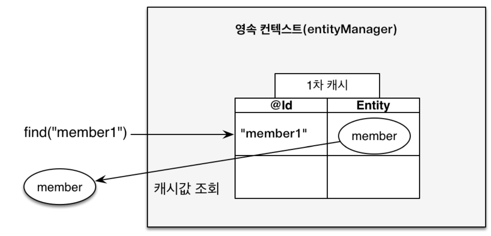
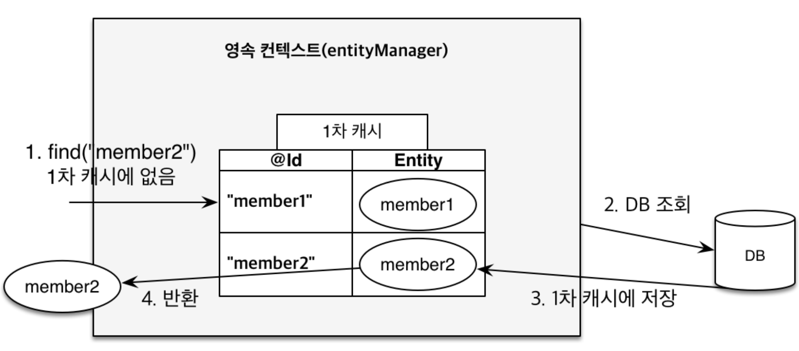
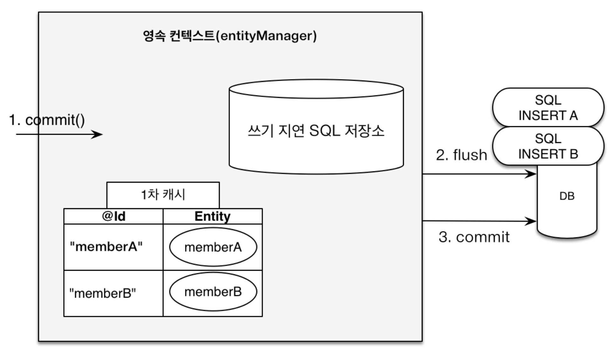
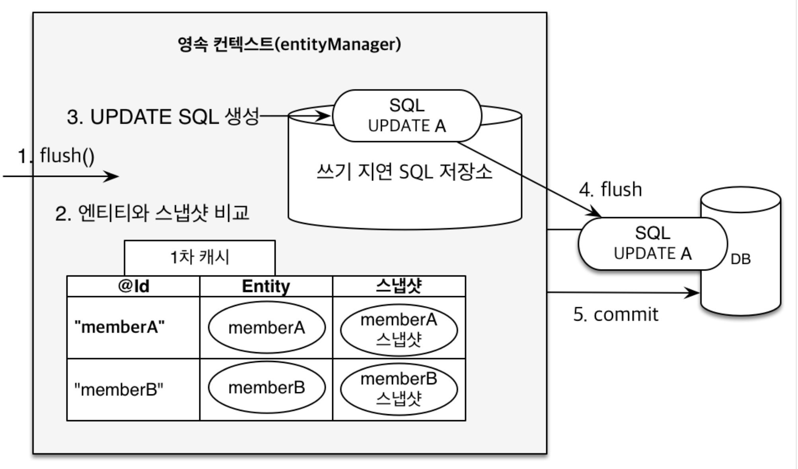

JPA에서 가장 중요한 것

- 객체와 관계형 데이터베이스 매핑 (Object Relational Mapping)
- 영속성 컨텍스트


영속성 컨텍스트

- JPA를 이해하는데 가장 중요한 용어
- "엔티티를 영구 저장하는 환경"이라는 뜻
- EntityManager.persist(entity); ->entity를 영속성 컨텍스트에 저장한다는 뜻의 코드
- 영속성 컨텍스트는 논리적인 개념
- 눈에 보이지 않음
- 엔티티 매니저를 통해 영속성 컨텍스트에 접근

엔티티의 생명주기

- 비영속(new/transient)

  영속성 컨텍스트와 전혀 관계가 없는 새로운 상태

  ```java
  //객체 생성한 상태(JPA와 관계 X)
  Member member = new Member();
  member.setId("member1");
  member.setUserName("회원1");
  ```

- 영속(managed)

  영속성 컨텍스트에 관리되는 상태

  ```java
  EntityManager em = emf.createEntityManager();
  EntityTransaction tx = em.getTransaction();
  tx.begin();
  
  //객체를 저장한 상태(영속)
  em.persist(member);
  ```

- 준영속(detached)

  영속성 컨텍스트에 저장되었다가 분리된 상태

  ```java
  //회원 엔티티를 영속성 컨텍스트에서 분리(준영속)
  em.detach(member);
  ```

- 삭제(removed)

  삭제된 상태

  ```java
  //객체를 삭제한 상태(삭제)
  em.remove
  ```

영속성 컨텍스트의 이점

- 1차 캐시

  ```java
  Member member = new Member();
  member.setId("member1");
  member.setUsername("회원1");
  
  //1차 캐시에 저장됨
  em.persist(member);
  
  //1차 캐시에서 조회
  Member member = em.find(Member.class, "member1");
  ```

  

  ```java
  Member findmember2 = em.find(Member.class, "member2");
  ```

  

- 동일성(identity) 보장

  ```java
  Member a = em.find(Member.class, "member1");
  Member b = em.find(Member.class, "member2");
  
  System.out.println(a==b); //true
  ```

  "em.find(Member.class, "member1")"를 반복해서 호출해도 영속성 컨텍스트는 1차 캐시에 있는 같은 엔티티 인스턴스를 반환한다.

- 트랜잭션을 지원하는 쓰기 지연(transactional write-behind)

  ```java
  EntityManager em = emf.createEntityManager();
  EntityTransaction tx = em.getTransaction();
  //앤티티 매니저는 데이터 변경시 트랜잭션 시작
  tx.begin(); // 트랜잭션 시작
  
  em.persist(memberA);
  em.persist(memberB);
  //여기까지 INSERT SQL을 데이터베이스에 보내지 않음
  
  //커밋하는 순간 데이터베이스에 INSERT SQL을 보냄
  tx.commit();
  ```

  

- 변경 감지(Dirty Checking)

  ```java
  //영속 엔티티 조회
  Member memberA = em.find(Member.class, "memberA");
  
  //영속 엔티티 데이터 수정
  memberA.setUsername("hi");
  member.setAge(10);
  //em.update(member)와 같은 코드 불필요. 영속 엔티티 데이터가 바로 수정됨
  tx.commit();
  ```

  

  [^스냅샷]: DB에서 1차 캐시에 들어온 순간의 값

- 지연 로딩(Lazy Loading)

플러시

- 영속성 컨텍스트의 변경내용을 데이터베이스에 반영(동기화)
- 영속성 컨텍스트를 비우지 않음
- 트랜잭션이라는 작업 단위 중요 -> 커밋 직전에만 동기화 하면 됨

플러시 발생

- 변경 감지
- 수정된 엔티티 쓰기 지연 SQL 저장소에 등록
- 쓰기 지연 SQL 저장소의 쿼리를 데이터베이스에 전송(등록, 수정, 삭제 쿼리)

플러시 방법

- em.flush() - 직접 호출

- 트랜잭션 커밋 - 플러시 자동 호출

- JPQL 쿼리 실행 - 플러시 자동 호출

  ```java
  em.persist(memberA);
  em.persist(memberB);
  
  //중간에 JPQL 실행
  query = em.createQuery("select m from Member m", Member.class);
  List<Member> members = query.getResultList();
  ```

플러시 모드 옵션(사용 필요 X)

```java
em.setFlushMode(FlushModeType.COMMIT)
```

- FlushModeType.AUTO

  커밋이나 쿼리를 실행할 때 플러시(기본값)

- FlushModeType.COMMIT

  커밋할 때만 플러시

준영속 상태

- 영속 -> 준영속
- 영속 상태의 엔티티가 영속성 컨텍스트에서 분리(detached)
- 영속성 컨텍스트가 제공하는 기능을 사용 X

준영속 상태로 만드는 방법

- em.detach(entity) - 특정 엔티티만 준영속 상태로 전환
- em.clear() - 영속성 컨텍스트를 완전히 초기화
- em.close() - 영속성 컨텍스트를 종료