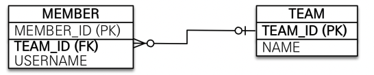

## 단방향 연관관계

---

### 예제 시나리오

- 회원과 팀이 있다.
- 회원은 하나의 팀에만 소속될 수 있다.
- 회원과 팀은 1:n 관계이다.

### 단방향 연관관계

---

#### 객체 지향 모델링

**객체 연관관계 사용**


**객체의 참조와 테이블의 외래 키를 매핑**

```java
@Entity
public class Member {
    @Id
    @GeneratedValue
    private Long id;
    @Column(name = "USERNAME")
    private String name;
    private int age;
    // @Column(name = "TEAM_ID")
// private Long teamId;
    @ManyToOne
    @JoinColumn(name = "TEAM_ID")
    private Team team;
}
```

**연관관계 저장**

```java
//팀 저장
 Team team = new Team();
 team.setName("TeamA");
 em.persist(team);
 //회원 저장
 Member member = new Member();
 member.setName("member1");
 member.setTeam(team); //단방향 연관관계 설정, 참조 저장
 em.persist(member);
```

**객체 그래프 탐색**

```java
//조회
 Member findMember = em.find(Member.class, member.getId());
//참조를 사용해서 연관관계 조회
 Team findTeam = findMember.getTeam();
```

**연관관계 수정**

```java
// 새로운 팀B
 Team teamB = new Team();
 teamB.setName("TeamB");
 em.persist(teamB);
 // 회원1에 새로운 팀B 설정
 member.setTeam(teamB);
```


### 양방향 연관관계와 연관관계의 주인

---


**양방향 매핑**

Member 엔티티는 단방향과 동일

```java
@Entity
public class Member {
    @Id
    @GeneratedValue
    @Column(name = "MEMBER_ID")
    private Long id;
    @Column(name = "USERNAME")
    private String username;
    private int age;
    @ManyToOne
    @JoinColumn(name = "TEAM_ID")
    private Team team;
}
```

Team 엔티티는 컬랙션 추가

```java
@Entity
public class Team {

    @Id
    @GeneratedValue
    @Column(name = "TEAM_ID")
    private Long id;
    private String name;

    @OneToMany(mappedBy = "team")
    private List<Member> memberList = new ArrayList<Member>();


}
```

**객체 그래프 탐색**

```java
//조회
 Team findTeam = em.find(Team.class, team.getId());
 int memberSize = findTeam.getMembers().size(); //역방향 조회
```

**객체의 양방향 관계**

- 객체의 양방향 관계는 사실 양방향 관계가 아닌 서로 다른 단방향 관계 2개이다.
- 객체를 양방향으로 참조하려면 단방향 연관관계를 2개 만들어야함

```
A -> B (a.getB())
B -> A (b.getA())
```


**테이블의 양방향 연관관계**

- 테이블은 외래 키 하나로 두 테이블의 연관관계를 관리
- MEMBER.TEAM_ID 외래 키 하나로 양방향 연관관계를 가짐(양쪽으로 JOIN 가능)

```sql
SELECT *
FROM MEMBER M
JOIN TEAM T ON M.TEAM_ID = T.TEAM_ID
```

```sql
SELECT *
FROM TEAM T
JOIN MEMBER M ON T.TEAM_ID = M.TEAM_ID
```



**연관관계의 주인(Owner)**

양방향 매핑 규칙

- 객체의 두 관계중 하나를 연관관계의 주인으로 지정

- 연관관계의 주인만이 외래 키를 관리(등록, 수정)

- 주인이 아닐경우 읽기만 가능

- 주인은 mappedBy 속성 사용 X

- 주인이 아닐경우 mappedBy 속성으로 주인 지정

- 주인 = 외래 키가 있는 곳(위의 경우 Member.team이 연관관계 주인)

  

**양방향 매핑시 가장 많이 하는 실수**

- 연관관계의 주인에 값을 입력하지 않음

  ```java
  Team team = new Team();
   team.setName("TeamA");
   em.persist(team);
   Member member = new Member();
   member.setName("member1");
   //역방향(주인이 아닌 방향)만 연관관계 설정
   team.getMembers().add(member);
   em.persist(member);
  ```

- 양방향 매핑시 연관관계의 주인에 값을 입력해야 함

- 순수한 객체 관계를 고려하면 항상 양쪽다 값을 입력해야한다.

  ```java
  Team team = new Team();
   team.setName("TeamA");
   em.persist(team);
   Member member = new Member();
   member.setName("member1");
   team.getMembers().add(member);
   //연관관계의 주인에 값 설정
   member.setTeam(team); //**
   em.persist(member);
  ```


### 양방향 연관관계 주의-실습

---

- 순수 객체 상태를 고려해서 항상 양쪽에 값을 설정하자
- 양방향 매핑시에 무한 루프를 조심하자
  - 예시: toString(), lombok, JSON 생성 라이브러리
  - controller에서 return 값을 entity로 반환하지 말자(변경 시 API 스팩이 바뀌게 됨. DTO로 반환 추천)


**양방향 매핑 정리**

- 단방향 매핑만으로도 이미 연관관계 매핑은 완료
- 양방향 매핑은 반대 방향으로 조회(객체 그래프 탐색) 기능이 추가된 것 뿐
- JPQL에서 역방향으로 탐색할 일이 많음
- 단방향 매핑을 잘 하고 양방향은 필요할 때 추가해도 됨(테이블에 영향 X)