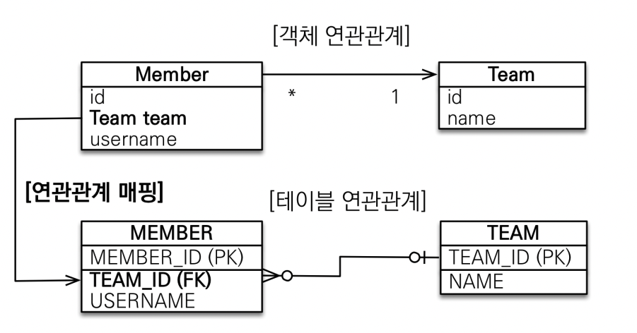
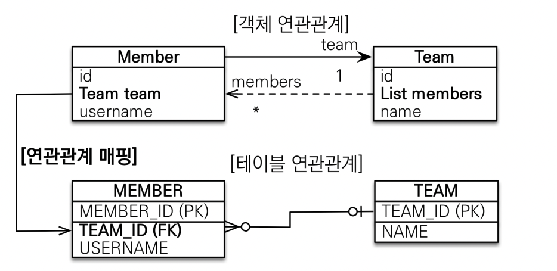
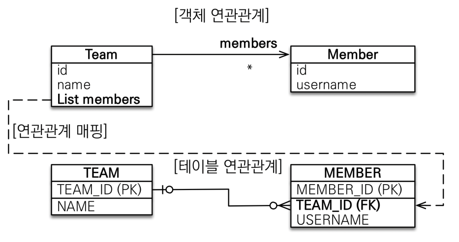
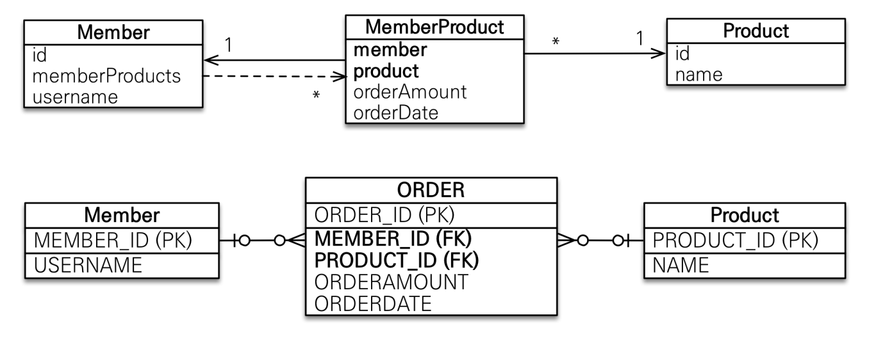
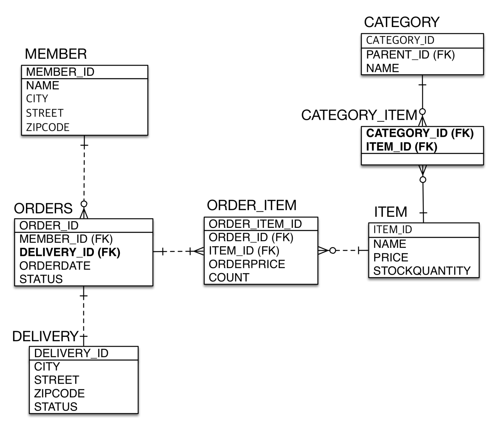

## 다대일[N:1]

---

### 다대일 단방향

- 가장 많이 사용하는 연관관계
- 다대일의 반대는 일대다

### 다대일 양방향

- 외래 키가 있는 쪽이 연관관계의 주인
- 양쪽을 서로 참조하도록 개발

## 일대다[1:N]

---

### 일대다 단방향

- 일대다(1:N)에서 일(1)이 연관관계의 주인
- 테이블 일대다 관계는 항상 다(N)쪽에 외래키가 있음
- 객체와 테이블의 차이 때문에 반대편 테이블의 외래 키를 관리하는 특이한 구조
- @JoinColumn을 꼭사용해야 함. 그렇지 않을 경우 조인 테이블 방식 사용(중간에 테이블 하나 추가)
- 연관관계 관리를 위해 추가로 UPDATE SQL 실행
- **일대다 단방향 매핑보다는 다대일 양방향 매핑 사용 지향**

### 일대다 양방향

- 공식적으로 존재 X
- @JoinColumn(insertable=false, updatable=false)
- 읽기 전용 필드를 사용해서 양방향 처럼 사용하는 방법
- **다대일 양방향 사용 지향**

## 일대일[1:1]

---

- 일대일 관계는 반대도 일대일
- 주 테이블이나 대상 테이블 중에 외래 키 선택 가능
  - 주 테이블에 외래 키
  - 대상 테이블에 외래 키
- 외래 키에 데이터베이스 유니크(UNI) 제약조건 추가
- 주 테이블에 외래 키
  - 단방향
    - 다대일(@ManyToOne) 단방향 매핑과 유사
  - 양방향
    - 외래 키가 있는 곳이 연관관계의 주인
    - 반대편은 mapped by 적용
- 대상 테이블에 외래 키
  - 단뱡향
    - JPA 지원 X
  - 양방향
    - 주 테이블에 외래 키 양방향과 매핑 방법은 같음
- **정리**
  - 주 테이블에 외래 키
    - 주 객체가 대상 객체의 참조를 가지는 것처럼 주 테이블에 외래 키를 두고 대상 테이블을 찾음
    - 객체지향 개발자 선호
    - JPA 매핑 편리
    - 장점 : 주 테이블만 조회해도 대상 테이블에 데이터 있는지 확인 가능
    - 단점 : 값이 없으면 외래 키에 null 허용
  - 대상 테이블에 외래 키
    - 대상 테이블에 외래 키가 존재
    - 전통적인 데이터베이스 개발자 선호
    - 장점 : 주 테이블과 대상 테이블을 일대일에서 일대다 관계로 변경할 때 테이블 구조 유지
    - 단점 : 프록시 기능의 한계로 지연 로딩으로 설정해도 항상 즉시 로딩됨

## 다대다[N:M]

---

- 관계형 데이터베이스는 정규화된 테이블 2개로 다대다 관계를 표현 X
- 연결 테이블을 추가해서 일대다[1:N], 다대일[N:1] 관계로 풀어야 함
- 객체는 컬렉션을 사용하여 객체 2개로 다대다 관계 가능
- @ManyToMany 사용
- @JoinTable로 연결 테이블 지정
- 단방향, 양방향 가능
- **한계**
  - 편리해 보이지만 실무에선 사용 X
  - 연결 테이블이 단순히 연결만 하고 끝나지 않음
  - 주문시간, 수량 같은 데이터가 들어올 수 있음
- **해결 방안**
  - 연결 테이블용 엔티티 추가(연결 테이블을 엔티티로 승격)
  - @ManyToMany -> @OneToMany, @ManyToOne

## 실전예제3 - 다양한 연관관계 매핑

---

### 배송, 카테고리 추가 - 엔티티

- 주문과 배송은 1:1
- 상품과 카테고리는 N:M

### N:M 관계는 1:N, N:1로

- 테이블의 N:M 관계는 중간 테이블을 이용해 1:N, N:1로 생성
- 실전에서는 중간 테이블이 단순하지 않음
- @ManyToMany는 제약: 필드 추가X, 엔티티 테이블 불일치
- 실전에서는 @ManyToMany 사용 X

### @JoinColumn

- 외래 키를 매핑할 때 사용

| 속성                                                                | 설명                                            | 기본값                          |
| ----------------------------------------------------------------- | --------------------------------------------- | ---------------------------- |
| name                                                              | 매핑할 외래 키 이름                                   | 필드명 + _ + 참조하는 테이블의 기본 키 컬럼명 |
| referencedColumnName                                              | 외래 키가 참조하는 대상 테이블의 컬럼명                        | 참조하는 테이블의 기본 키 컬럼명           |
| foreignKey(DDL)                                                   | 외래 키 제약조건을 직접 지정 가능 이 속성은 테이블을 생성할 때만 사용 |                              |
| unique, nullable, insertable, updateable, columnDefinition, table | @Column의 속성과 동일                               |                              |

### @ManyToOne

- 다대일 관계 매핑

| 속성           | 설명                                                                                        | 기본값                                                           |
| ------------ | ----------------------------------------------------------------------------------------- | ------------------------------------------------------------- |
| optional     | false로 설정하면 연관된 엔티티가 항상 있어야 한다.                                                           | TRUE                                                          |
| fetch        | 글로벌 페치 전략을 설정한다.                                                                          | - @ManyToOne=FetchType.EAGER - @OneToMany=FetchType.LAZY |
| cascade      | 영속성 전이 기능을 사용한다.                                                                          |                                                               |
| targetEntity | - 연관된 엔티티의 타입 정보를 설정한다.  - 이 기능은 거의 사용하지 않는다.  - 컬렉션을 사용해도 제네릭으로 타입 정보를 알 수 있다. |                                                               |

### @OneToMany

- 다대일 관계 매핑

| 속성           | 설명                                                                                        | 기본값                                                           |
| ------------ | ----------------------------------------------------------------------------------------- | ------------------------------------------------------------- |
| mappedBy     | 연관관계의 주인 필드를 선택한다.                                                                        |                                                               |
| fetch        | 글로벌 페치 전략을 설정한다.                                                                          | - @ManyToOne=FetchType.EAGER - @OneToMany=FetchType.LAZY |
| cascade      | 영속성 전이 기능을 사용한다.                                                                          |                                                               |
| targetEntity | - 연관된 엔티티의 타입 정보를 설정한다.  - 이 기능은 거의 사용하지 않는다.  - 컬렉션을 사용해도 제네릭으로 타입 정보를 알 수 있다. |                                                               |
