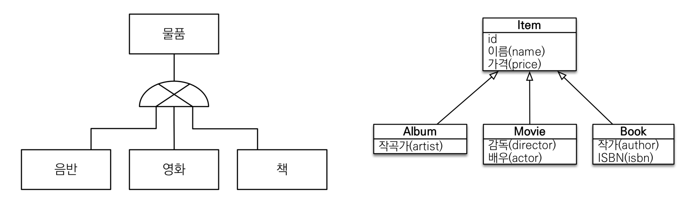
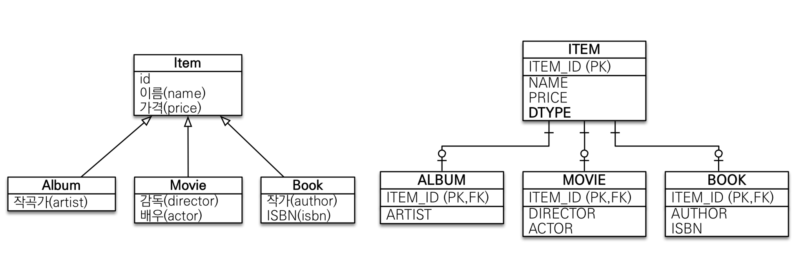
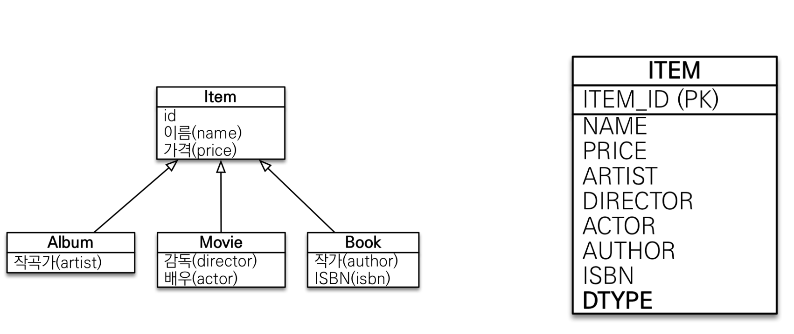
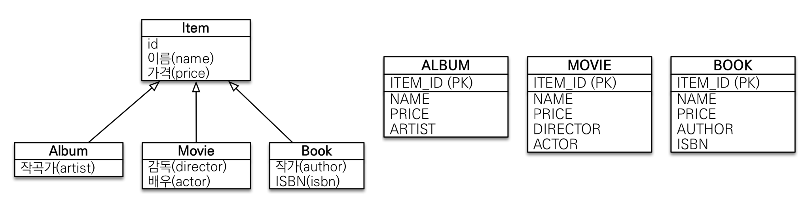
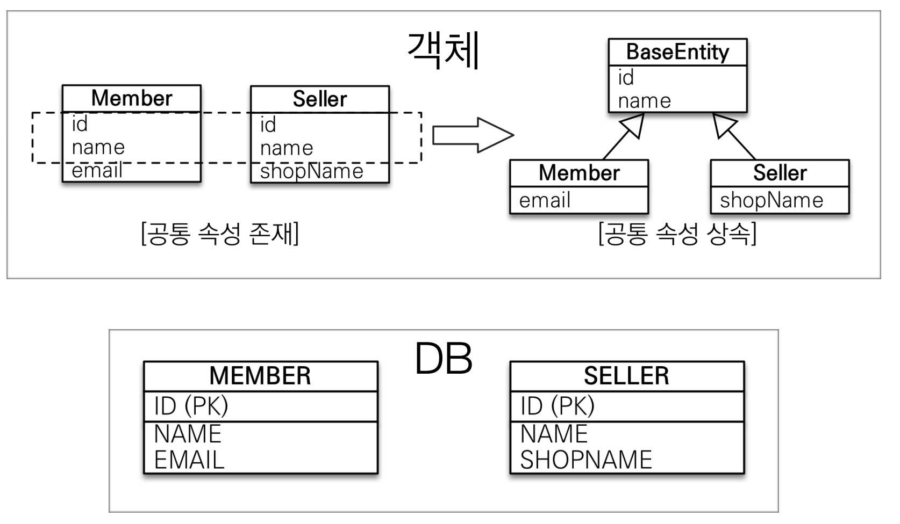

## 상속관계 매핑

---

- 관계형 데이터베이스는 상속 관계 X
- 슈퍼타입 서브타입 관계라는 모델링 기법이 객체 상속과 유사
- 상속관계 매핑: 객체의 상속과 구조와 DB의 슈퍼타입 서브타입 관계를 매핑

### 슈퍼타입 서브타입 논리 모델을 실제 모델로 구현하는 방법

#### - 조인 전략

- 각각 테이블로 변환
- @Inheritance(strategy = InheritanceType.*JOINED*)
- 장점
  - 테이블 정규화
  - 외래 키 참조 무결성 제약조건 활용 가능
  - 저장공간 효율화
- 단점
  - 조회시 조인을 많이 사용 -> 성능 저하
  - 조회 쿼리가 복잡함
  - 데이터 저장 시 INSERT SQL 2번 호출

#### - 단일 테이블 전략

- 통합테이블로 변환
- @Inheritance(strategy = InheritanceType.*SINGLE_TABLE*)
- insert query 1회, join X -> 성능상 이점 존재
- 장점
  - 조인이 필요 없음 -> 성능 향상
  - 조회 쿼리가 단순함

- 단점
  - 자식 엔티티가 매핑한 컬럼은 모두 null 허용
  - 단일 테이블에 모든 걸 저장하여 테이블이 너무 커질경우 오히려 조회 성능이 낮아질 수 있음

#### - 구현 클래스마다 테이블 전략(사용 X)

- 서브타입 테이블로 변환
- DB관점 및 코드 관점 둘 다 추천 X
- 장점
  - 서브 타입을 명확하게 구분해 처리할 때 효과적
  - not null 제약조건 사용 가능
- 단점
  - 여러 자식 테이블을 함께 조회할 때 성능 느림(UNION SQL)
  - 자식 테이블을 통합해서 쿼리하기 어려움

### 주요 어노테이션

##### @Inheritance(strategy=InheritanceType.XXX)

- JOINED: 조인 전략
- SINGLE_TABLE: 단일 테이블 전략
- TABLE_PER_CLASS: 구현 클래스마다 테이블 전략

##### @DiscriminatorColumn(name="DTYPE")

- 어느 테이블에서 들어온 정보인지 확인 가능(기본 컬럼명 = DTYPE)
- 부모 클래스에서 사용

##### @DiscriminatorValue=("XXX")

- DTYPE에 들어갈 명령어를 정함
- 기본값 = Entity 이름
- 자식 클래스에서 사용

## @MappedSuperclass

> 공통 매핑 정보가 필요할 때 사용(id, name)

- 상속관계 매핑 X
- 엔티티X, 테이블과 매핑 X
- 부모 클래스를 상속 받는 자식 클래스에 매핑 정보만 제공
- 조회, 검색 불가(em.find(BaseEntity) 불가능)
- 직접 생성하여 사용할 일이 없으므로 추상 클래스 권장

- 테이블과 관계 없고, 단순히 엔티티가 공통적으로 사용하는 매핑 정보를 모으는 역할
- 주로 등록일, 수정일, 등록자, 수정자 같은 전체 엔티티에 공통으로 적용하는 정보를 모을 때 사용
- 참고: @Entity 클래스는 엔티티나 @MappedSupserclass로 지정한 클래스만 상속 가능
