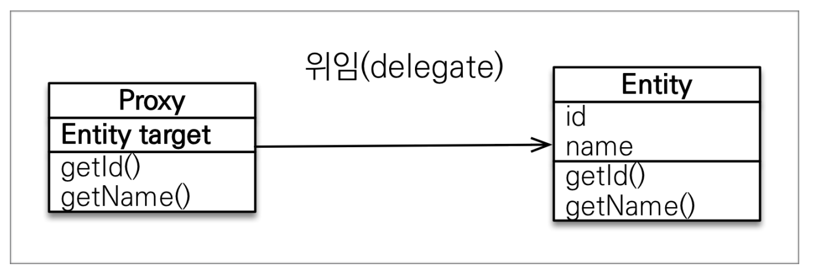
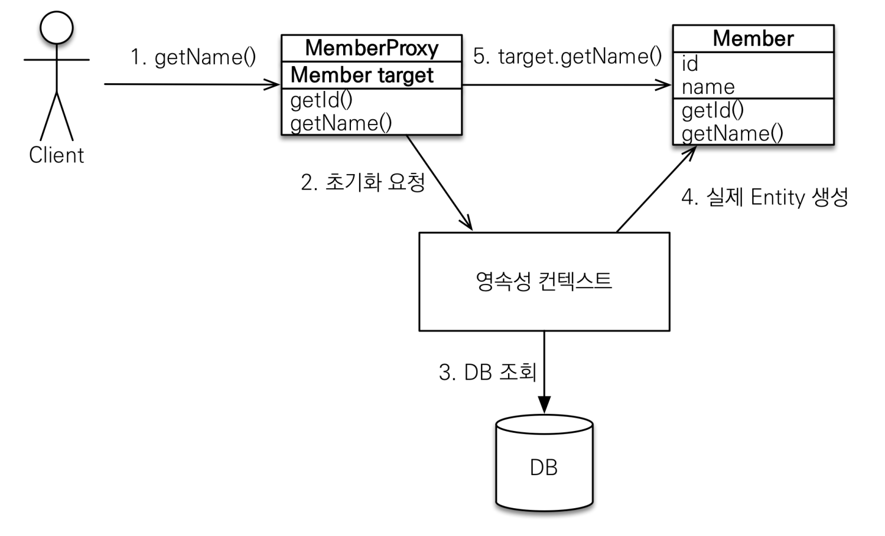

# 프록시와 연관관계 관리


## 목차

- 프록시
- 즉시 로딩과 지연 로딩
- 지연 로딩 활용
- 영속성 전이 : CASCADE
- 고아 객체
- 영속성 전이 + 고아 객체, 생명주기


## 프록시

---

#### 프록시란

- em.find(): 데이터베이스를 통해서 실제 엔티티 객체 조회
- em.getReference(): 데이터베이스 조회를 미루는 가짜(프록시) 엔티티 객체 조회


#### 프록시의 특징

- 실제 클래스를 상속 받아 만들어짐
- 실재 클래스와 겉 모양이 같다.
- 사용자 입장에선 진짜 객체인지 프록시 객체인지 구분 필요 X(이론상)



- 프록시 객체는 실제 객체의 참조(target)를 보관
- 프록시 객체를 호출하면 프록시 객체는 실제 객체의 메소드 호출
- 프록시 객체는 처음 사용할 때 한 번 만 초기화

```java
Member member = em.getReference(Member.class, "id1");
member.getName();

System.out.println("member.username = " + member.getUsername()); // DB 조회System.out.println("member.username = " + member.getUsername()); // 추가 조회 X
```



- 프록시 객체를 초기화 할 때, 프록시 객체가 실제 엔티티로 바뀌는 것은 아님.(초기화 후 프록시 객체를 통해 실제 엔티티에 접근 가능)

- 프록시 객체는 원본 엔티티를 상속받음 -> 타입 체크시 주의 필요(==비교 X | instance of 사용)

- 영속성 컨텍스트에 찾는 엔티티가 이미 있으면 em.getReference()를 호출해도 실제 엔티티 반환

- 영속성 컨텍스트의 도움을 받을 수 없는 상태(준영속 상태)의 경우 프록시 초기화시 문제 발생

  (Hibernate의 경우 org.hibernate.LazyInitializationException 발생)


#### 프록시 확인

- **프록시 인스턴스의 초기화 여부 확인**

  PersistenceUnitUtil.isLoaded(Object entity);

  ```java
  Member refMember = em.getRefernce(Member.class, member1.getId());
  refMember.getUsername();	// refMember 초기화
  emf.getPersistenceUnitUtil().isLoaded(refMember);	// true
  ```

- **프록시 클래스 확인 방법**

  entity.getClass().getName() 출력(..javasist.. or HibernateProxy..)

- **프록시 강제 초기화**

  ```java
  org.hibernate.Hibernate.initalize(entity);
  ```

  참고 : JPA 표준은 강제 초기화 X**

  강제 호출 : member.getName();


## 즉시 로딩과 지연 로딩

---


#### 지연 로딩

- 대부분 member 정보만 필요할 경우 사용
- 지연 로딩 LAZY를 사용해서 프록시로 조회
- 두 정보가 동시에 필요할 땐 비효율적임(query가 두 번 발생)

```java
 @ManyToOne(fetch = FetchType.LAZY) // 프록시로 조회
```

```java
Team team = member.getTeam();
team.getName(); // 실제 team을 사용하는 시점에 초기화 (DB 조회)
```


#### 즉시 로딩

- 두 정보(team, member)가 동시에 활용되는 경우가 많을 경우 사용
- 즉시 로딩 EAGER를 사용해서 함께 조회

```java
@ManyToOne(fetch = FetchType.EAGER) // 두 테이블을 함께 조회
```

```java
Member m = em.find(Member.class, member1.getId());
m.getTeam().getClass(); // class hellojpa.Team
```

- JPA 구현체는 가능하면 Join을 이용하여 SQL 한 번에 함께 조회


#### 프록시와 즉시 로딩 주의

- **가급적 지연 로딩만 사용**(특히 실무의 경우)

  - 즉시 로딩을 사용하면 예상치 못한 SQL이 발생

  - 즉시 로딩은 JPQL에서 N+1의 문제를 일으킨다.
  
    ```
    List<Member> members = em.createQuery("select m from Member m", Member.class)
      .getResultList();		// Member 전체 조회 후 즉시 로딩일 경우 Team도 전체 조회
    ```
  
  - select * from Member; -> 멤버 전체 조회
  
    - select * from Team where TEAM_id = ... -> 조회된 member의 수 만큼 Team 조회 쿼리 발생
  
- @ManyToOne, @OneToOne는 기본이 즉시 로딩

    **-> LAZY로 설정 필요**

- @OneToMany, @ManyToMany는 기본이 지연 로딩


#### 지연 로딩 활용

> 실무에선 무조건 지연 로딩 사용 권장

- Member와 Team은 자주 함께 사용 -> 즉시 로딩
- Member와 Order는 가끔 사용 -> 지연 로딩
- Order와 Product는 자주 함께 사용 -> 즉시 로딩


#### 지연 로딩 활용(실무)

- **모든 연관 관계에 지연 로딩 사용**
- 실무에선 즉시 로딩 사용 X
- JPQL fetch 조인 & 엔티티 그래프 기능 활용
- 즉시 로딩은 쿼리 예상 불가능


## 영속성 전이와 고아 객체

---


#### 영속성 전이: CASCADE

- 특정 엔티티를 영속 상태로 만들 때 연관된 엔티티도 함께 영속 상태로 만들고 싶을 때

  예시 : 부모 엔티티를 저장할 때 자식 엔티티도 함께 저장

  ```java
  @OneToMany(mappedBy="parent", cascade=CascadeType.PERSIST)
  ```


- 영속성 전이는 연관관계를 매핑하는 것과 아무 관련이 없음(엔티티 영속화 시 연관된 엔티티도 함께 영속화하는 기능만 제공)

- CASCADE의 종류
  - **ALL**: 모두 적용
  - **PERSIST**: 영속
  - **REMOVE**: 삭제
  - MERGE: 병합
  - REFRESH: REFRESH
  - DETACH: DETACH


#### 고아 객체

- 고아 객체 제거: 부모 엔티티와 연관관계가 끊어진 자식 엔티티를 자동으로 삭제

- **orphanRemoval = true**

  ```java
  Parent parent1 = em.find(Parent.class, id);
  parent1.getChildren().remove(0);	// 자식 엔티티를 컬렉션에서 제거
  // DELETE FROM CHILD WHERE ID = ?
  ```

  - 참조가 제거된 엔티티는 다른 곳에서 참조하지 않는 고아 객체로 보고 삭제하는 기능

  - 참조하는 곳이 하나일 때만 사용
  - 특정 엔티티가 개인 소유할 때만 사용
  - **@OneToOne**, **@OneToMany**만 사용 가능
  - orphanRemoval 활성화 시 부모를 제거할 때 자식도 함께 제거됨 -> **CascadeType.REMOVE**와 유사


#### 영속성 전이 + 고아 객체, 생명주기

```java
CasecadeType.ALL + orphanRemoval=true
```

- 스스로 생명주기를 관리하는 엔티티는 em.persist()로 영속화, em.remove()로 제거
- 두 옵션을 모두 활성화 하면 부모 엔티티를 통해 자식의 생명 주기 관리 가능
- 도메인 주도 설계(**D**omain **D**riven **D**esign)의 Aggregate Root개념을 구현할 때 유용