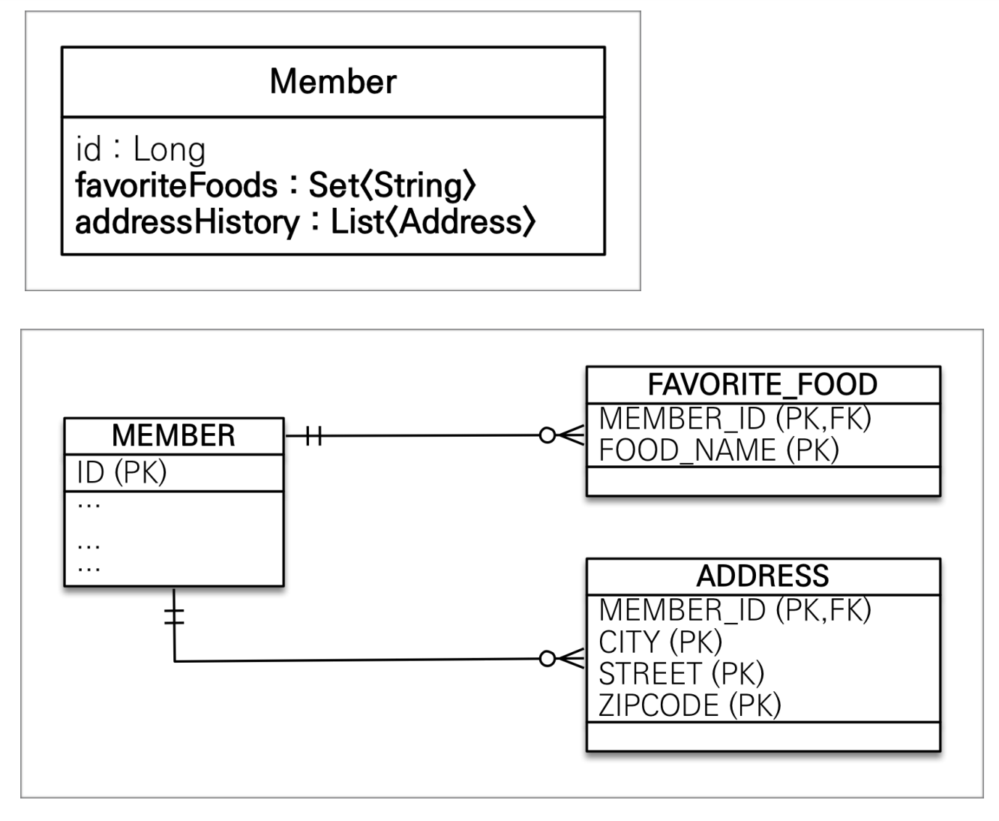

# 값 타입


## 목차

- 기본값 타입
- 임베디드 타입(복합 값 타입)
- 값 타입과 불변 객체
- 값 타입의 비교
- 값 타입 컬렉션


## 기본값 타입

---

#### JPA 데이터 타입 분류

**엔티티 타입**

- @Entity로 정의하는 객체

- 데이터가 변해도 식별자로 지속해서 추적이 가능

  예시: 회원 엔티티의 키나 나이 값을 변경하여도 식별자로 인식 가능

**값 타입**

- int, Integer, String처럼 단순히 값으로 사용하는 자바 기본 타입 or 객체

- 식별자가 없고 값만 있기 때문에 변경시 추적 불가

  예시: 숫자 100을 200으로 변경하면 완전히 다른 값으로 대체


#### 값 타입

**기본값 타입**

- 자바 기본 타입(int, double)
- 래퍼 클래스(Integer, Long)
- String

**임베디드 타입**(embedded type, 복합 값 타입)

**컬렉션 값 타입**(collection value type)


#### 기본 값 타입

> String name, int age

- 생명주기를 엔티티에 의존

  예시: 회원을 삭제하면 이름, 나이 필드도 함께 삭제

- 값 타입은 공유하면 안 됨

  예시: 회원 이름 변경시 다른 회원의 이름도 함께 변경되면 안 됨

- 참고(자바의 기본 타입은 절대 공유 X)

  - int, double 같은 기본 타입(primitive type)은 절대 공유 X
  - 기본 타입은 항상 값을 복사
  - Integer같은 래퍼 클래스나 String 같은 특수한 클래스는 공유 가능한 객체 이지만 변경 X


## 임베디드 타입

---

- 새로운 값 타입을 직접 정의할 수 있음
- JPA는 임베디드 타입(embedded type)이라 함
- 주로 기본 값 타입을 모아서 만들어 복합 값 타입이라고도 함
- int, String과 같은 **값 타입**


#### 예시

임베디드 타입 사용 X

> 회원 엔티티는 이름, 근무 시작일, 근무 종료일, 주소 도시, 주소 번지, 주소 우편번호를 가진다.

- id (Long)
- name (String)
- startDate (Date)
- endDate (Date)
- city (String)
- street (String)
- zipcode (String)

임베디드 타입 사용 O

> 회원 엔티티는 이름, 근무 기간, 집 주소를 가진다.

- id (Long)
- name (String)
- workPeriod (Value Type)
- homeAddress (Value Type)


#### 사용법

- @Embeddable: 값 타입을 정의하는 곳에 표시
- @Embedded: 값 타입을 사용하는 곳에 표시
- **기본 생성자 필수**


#### 장점

- 재사용
- 높은 응집도
- Period.isWork()처럼 해당 값 타입만 사용하는 의미있는 메소드를 만들 수 있음
- 임베디드 타입을 포함한 모든 값 타입은, 값 타입을 소유한 엔티티에 생명주기를 의존함


#### 테이블 매핑


- 임베디드 타입은 엔티티의 값일 뿐이다.
- 임베디드 타입을 사용하기 전과 후의 **매핑하는 테이블은 같다.**
- 객체와 테이블을 아주 **세밀하게(find-grained) 매핑**하는 것이 가능
- 잘 설계한 ORM 애플리케이션은 매핑한 테이블의 수보다 클래스의 수가 더 많음


#### @AttributeOverride(속성 재정의)

- 한 엔티티에서 같은 값 타입을 사용할 경우 사용
- @AttributeOverrides | @AttributeOverride를 사용해 컬럼 명 속성을 재정의

```java
@Embedded
private Address homeAddress;	// work_city, work_street, work_zipcode

@Embedded
@AttributeOverrides({
  @AttributeOverride(name="city", column=@Column("WORK_CITY")),
  @AttributeOverride(name="city", column=@Column("WORK_STREET")),
  @AttributeOverride(name="city", column=@Column("WORK_ZIPCODE"))
})
private Address workAddress;	// WORK_CITY, WORK_STREET, WORK_ZIPCODE
```


**임베디드 타입의 값이 null이면 매핑한 컬럼 값은 모두 null이다.**


## 값 타입과 불변 객체

---

> 값 타입은 복잡한 객체 세상을 조금이라도 단순화하려고 만든 개념이다. 따라서 값 타입은 단순하고 안전하게 다룰 수 있어야 한다.


#### 값 타입 공유 참조

- 임베디드 타입 같은 값 타입을 여러 엔티티에서 공유하면 위험함
- 부작용(side effect) 발생

```java
Address address = new Address("city", "street", "10000");

Member member = new Member();
member.setUsername("member1");
member.setHomeAddress(address);
em.persist(member);

Member member2 = new Member();
member.setUsername("member2");
member2.setHomeAddress(address);
em.persist(member2);

member.getHomeAddress().setCity(bnew city)
```


#### 객체 타입의 한계

- 항상 값을 복사해서 사용할 경우 공유 참조로 인해 발생하는 부작용 회피 가능

- 문제는 임베디드 타입처럼 직접 정의한 값 타입은 자바의 기본 타입이 아닌 객체 타입

  - 기본 타입

    ```java
    int a = 10;
    int b = a;	// 기본 타입은 값을 복사
    b = 4;			// a=10 | b=4
    ```

  - 객체 타입

    ```java
    Address a = new Address("Old");
    Address b = a;	// 객체 타입은 참조를 전달
    b.setCity("New");		// a=New | b=New
    ```

- 자바 기본 타입에 값을 대입하면 값을 복사

- 객체 타입은 참조 값을 직접 대입하는 것을 막을 수 없음

  -> 객체의 공유 참조는 피할 수 없다.


#### 불변 객체

> 생성 시점 이후 절대 값을 변경할 수 없는 객체

- 객체 타입을 수정할 수 없게 만들면 부작용을 원천 차단 가능

- 값 타입은 불변 객체(immutable object)로 설계해야함

- 생성자로만 값을 설정하고 수정자(Setter)를 만들지 않으면 됨

- 참고: Integer, String은 자바가 제공하는 대표적인 불변 객체

  


## 값 타입의 비교

---

- 값 타입: 인스턴스가 달라도 그 안에 값이 같으면 같은 것으로 봐야 함

```java
int a = 10;
int b = 10;		// a == b -> true

Address c = new Address("city", "street", "10000");
Address c = new Address("city", "street", "10000");		// c == d -> false
```

- 동일성(identity) 비교: 인스턴스의 참조 값을 비교(== 사용)
- 동등성(equivalence) 비교: 인스턴스의 값을 비교(equals() 사용)
- 값 타입은 a.equals(b)를 사용해서 동등성 비교를 해야 함
- 값 타입의 equals() 메소드를 적절하게 재정의(주로 모든 필드 사용)

```java
@Override
public boolean equals(Object o) {
  if (o ==null || getClass() != o.getClass()) return false;
  Address address = (Address) o;
  return Objects.equals(city, address.city) &&
    Objects.equals(street, address.street) &&
    Objects.equals(zipcode, address.zipcode);
}

@Override
public int hashCode() {
  return Objects.hash(city, street, zipcode);
}

...
  
Address c = new Address("city", "street", "10000");
Address c = new Address("city", "street", "10000");

System.out.println("address1 == address2: " + (address1 == address2)); // false
System.out.println("address1 equals address2: " + (address.equals(address2)); // true
```


## 값 타입 컬렉션



- 값 타입을 하나 이상 저장할 때 사용
- @ElementCollection, @Collection Table 사용

```java
@Entity
public class Member{
  @Id
  @GeneratedValue
  @Column(name = "MEMBER_ID")
  private Long id;
  
  @Embedded
  private Address homeAddress;
  
  @ElementCollection	//값 타입 컬렉션 지정
  @CollectionTable(name = "FAVORITE_FOOD", joinColumns = 
                  @JoinColumn(name = "MEMBER_ID"))	// 컬렉션 테이블 지정
  @Column(name = "FOOD_NAME")
  private Set(STring) favoriteFoods = new HashSet<>();
  
  @ElementCollection
  @CollectionTable(name = "ADDRESS", joinColumns = 
                  @JoinColumn(name = "MEMBER_ID"))
  private List<Address> addressHistory = new ArrayList<>();
}
```

- 데이터베이스는 컬렉션을 같은 테이블에 저장할 수 없다.
- 컬렉션을 저장하기 위한 별도의 테이블이 필요함


#### 값 타입 컬렉션의 제약사항

- 값 타입은 엔티티와 다르게 식별자 개념이 없다.
- 값은 변경하면 추적이 어렵다.
- 값 타입 컬렉션에 변경 사항이 발생하면 주인 엔티티와 관련된 모든 데이터를 삭제하고, 값 타입 컬렉션에 있는 현재 값을 모두 다시 저장
- 값 타입 컬렉션을 매핑하는 테이블은 모든 컬럼을 묶어서 기본 키를 구성해야 함. null 입력 X, 중복 저장 X