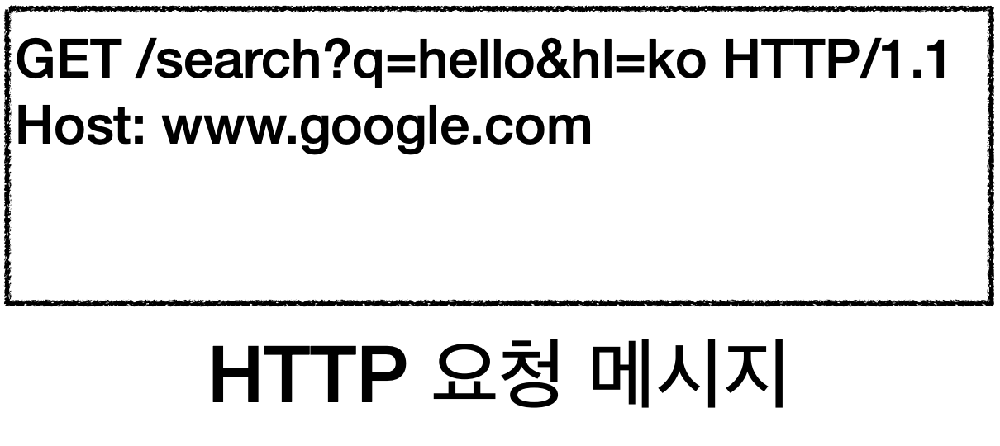
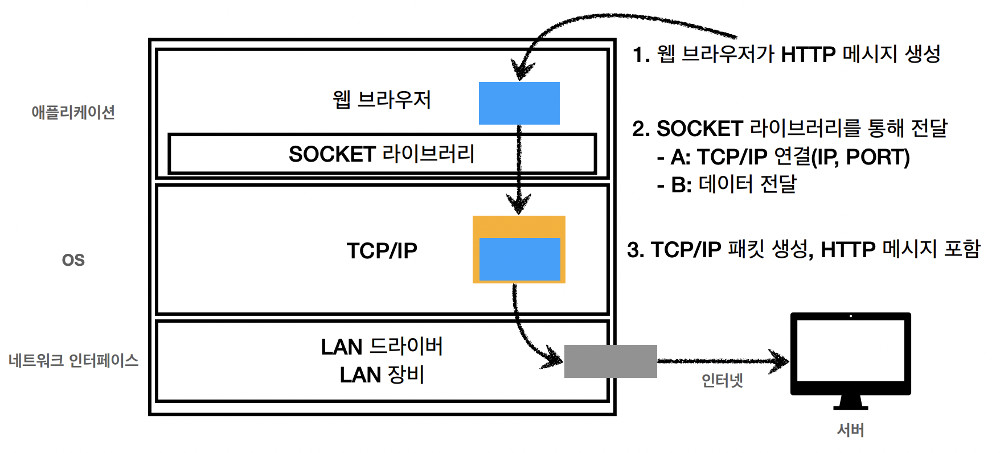
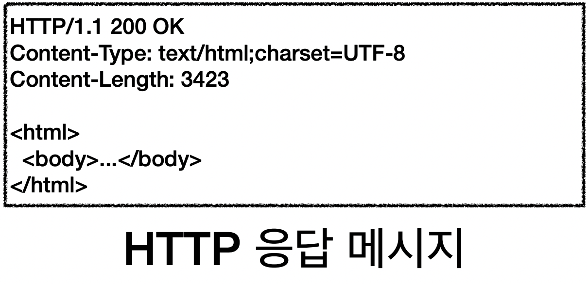

## URI와 웹 브라우저 요청 흐름

------


## URI

------


**URI(Uniform Resource Identifier)**

**<u>U</u>niform** :  리소스를 식별하는 통일된 방식

**<u>R</u>esource** : 자원, URI로 식별할 수 있는 모든 것(제한 X)

**<u>I</u>dentifier** : 다른 항목과 구분하는 데 필요한 정보

- **URL(Uniform Resource Locator)** - Locator : 리소스가 있는 위치를 지정
- **URN(Uniform Resource Name)** - Name : 리소스에 이름 부여
- 위치는 변할 수 있지만 이름은 변하지 않음
- **URN** 만으로 실제 리소스 찾는 방법은 **보편화 X**

### URL 문법

scheme://[userinfo@]host[:port].[/path].[?query].[#fragment] ('.'은 제외)

https://www.google.com:443/search?q=hello&hl=ko

- **scheme**(https)
  - 주로 프로토콜 사용
- **userinfo**
  - URL에 사용자정보를 포함해서 인증
  - 거의 사용 X
- **host**(www.google.com)
  - 호스트명
  - 도메인명 또는 IP 주소를 직접 사용가능
- **port**(:443)
  - 접속 포트
  - 일반적으로 생략(http는 80, https는 443)
- **path**(search)
  - 리소스 경로
  - 계층적 구조
- **query**(?q=hello&hl=ko)
  - key = value 형태
  - ?로 시작, &로 추가 가능
  - query parameter, query string 등으로 불림
- **fragment**
- html 내부 북마크 등에 사용
- 서버에 전송하는 정보 아님


## 웹 브라우저 요청 흐름

------

**웹 브라우저에 요청시 흐름**

```
예시 URL : 
					https://www.google.com:443/search?q=hello&hl=ko
```

1. DNS 서버를 조회하고 HTTP 요청 메세지 생성



2. TCP / IP 패킷 생성 후 인터넷을 통해 서버에 전달

   

3. 서버에서 HTTP 응답 메세지 생성

   

4. 응답 메세지의 html 부분을 렌더링하여 사용자에게 전달

