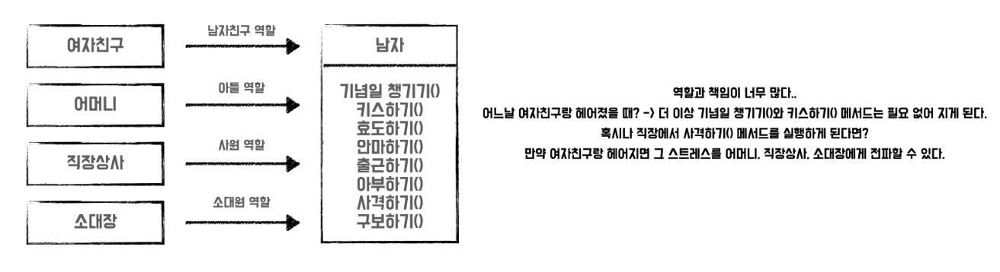
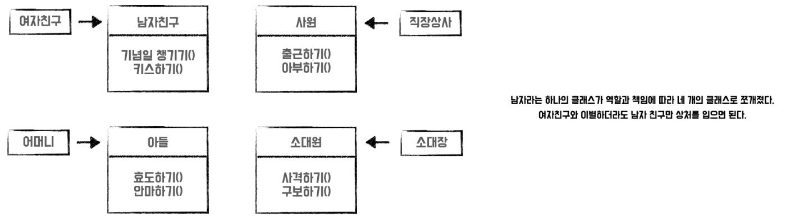
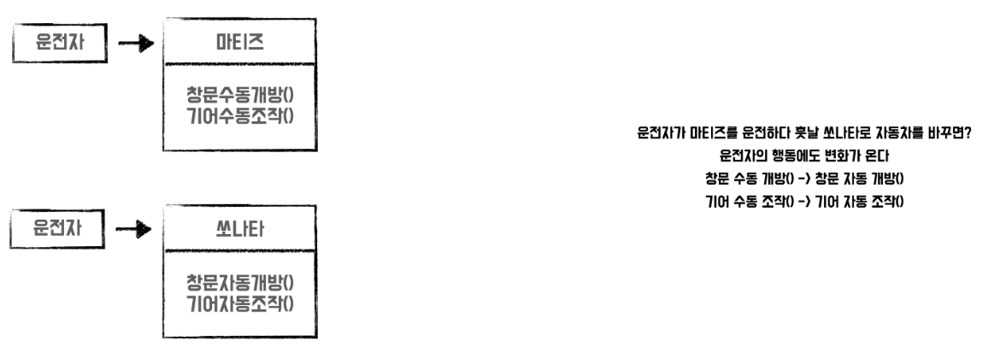
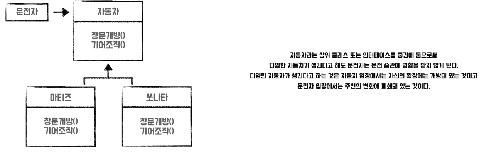
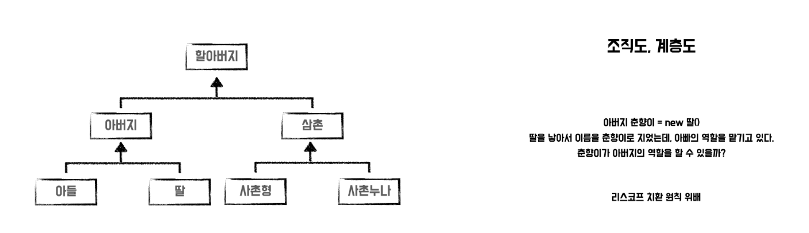
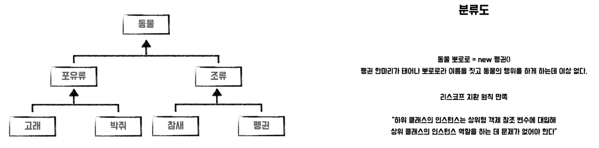

## 객체 지향 설계 5원칙 - SOLID

------

### SOLID


**객체 지향 프로그래밍 및 설계의 다섯가지 기본 원칙**

- 유지보수하기 쉬움
- 확장이 쉬운 소프트웨어 개발 가능


### <u>S</u>RP(Single Responsibility Priniciple) - 단일 책임 원칙

------

#### 소프트웨어를 구성하는 클래스나 함수 등의 부품은 단 하나의 기능만을 가져야한다는 걸 의미

**예시 1. **





**예시 2.**

```java
// SRP 원칙 위반
public class Dog {
    final static Boolean man = true;
    final static Boolean woman = false;
    Boolean sex;
 
    void pee() {
        if (this.sex == man) {
            // 한쪽 다리를 들고 소변을 본다.
        } else {
            // 뒷다리 두 개를 굽혀 앉은 자세로 소변을 본다.
        }
    }
}
```

```java
// SRP 원칙 지킴
abstract class Dog {
    abstract void pee();
}
 
class ManDog extends Dog {
    @Override
    void pee() {
        // 한쪽 다리를 들고 소변을 본다
    }
}
 
class WomanDog extends Dog {
    @Override
    void pee() {
        // 뒷다리 두 개로 앉은 자세로 소변을 본다.
    }
}
```

**하나의 함수가 소프트웨어 내에서 책임져야할 부분이 많은 경우**

- 내부 변경이 어려움
- 다른 요소들과의 연계가 강함 -> 유지보수 비용 증가

**SRP를 지켜서 개발 할 경우**

- 코드의 가독성 향상
- 유지보수 용이


### <u>O</u>CP(Open Closed Principle) - 개방 · 폐쇄 원칙

------

**소프트웨어의 구성요소(컴포넌트, 클래스, 모듈, 함수)는 확장에 열려있고, 변경에 닫혀있어야 한다는 의미**

-> 변경, 추가사항이 발생해도 기존 구성요소는 수정 X, 기존 구성요소를 쉽게 확장해 재사용 할 수 있어야 함

**예시 1.**





**예시 2.**

```java
// OCP 원칙 위반
public class Driver {

	public static void main(String[] args) {
		
		// 트럭 운전 인스턴스 생성
		Truck driver1 = new Truck();
		driver1.drive();
		
		//버스 운전 인스턴스 생성
		Bus driver2 = new Bus();
		driver2.drive();
	}
}

class Truck{
	public void drive() {
		System.out.println("Truck Drive");
	}
}

class Bus{
	public void drive() {
		System.out.println("Bus Drive");
	}	
}
```

-> 운전자의 차종이 바뀔 경우 운전자는 새로운 drive() 실행 필요

```java
// OCP 원칙 준수
public class Driver {

	public static void main(String[] args) {
		
		Car[] driver = new Car[2];
		driver[0] = new Truck(); 
		driver[1] = new Bus();
		
		for (int i = 0; i < driver.length; i++) {
			driver[i].drive(); // 출력 결과 : drive[0] -> Truck Drive / drive[1] -> Bus Drive 
		}
	}
}

class Car{
	public String carType = "";
	
	public void car(String carType) {
	    this.carType =carType; 
	}
	
	public void setCarType(String carType) {
	    this.carType =carType; 
	}
		
	public void drive() {
	    System.out.println(carType + " Drive");
	}
}

class Truck extends Car{
	
	public Truck() {
	    setCarType("Truck");
	}
	
	@Override
	public void drive() {
	    super.drive();
	}
}


class Bus extends Car{
	
	public Bus() {
	    setCarType("Bus");
	}	
	
	@Override
	public void drive() {
	    super.drive();
	}
}
```


### <u>L</u>SP(Liskov Substitution Principle) - 리스코프 치환 원칙

------

**부모 클래스와 자식 클래스 사이에는 일관된 행위가 있어야 함**

- 자식 클래스는 부모 클래스에서 가능한 행위를 수행해야 함
- 부모 클래스의 인스턴스 대신 자식 클래스의 인스턴스를 사용해도 문제가 없어야 함

**예시 1.**






### <u>I</u>SP(Interface Segregation Principle) - 인터페이스 분리 원칙

------

**한 클래스는 자신이 사용하지 않는 인터페이스는 구현하지 말아야 함**

-> 기능에 대한 변경의 여파 최소화 가능 

**예시 1.**

```java
// ISP 위반
public interface multifunction {
  void copy();
  void fax(Address from, Address to);
  void print();
}

public class copyMachine implements multifunction {
  @Override
  public void copy() {
    System.out.println("### 복사 ###");
  }

  @Override
  public void fax(Address from, Address to) {
    // 사용하지 않는 인터페이스가 변경되어도 함께 수정이 일어난다.
  }

  @Override
  public print() {
    // 사용하지 않는 인터페이스가 변경되어도 함께 수정이 일어난다.
  }
}
```

```java
// ISP 지킴
public interface Print{
  void print();
}

public interface Copy {
  void copy();
}

public interface Fax {
  void fax(Address from, Address to);
}

public class copyMachine implements Copy {
  @Override
  void copy() {
    System.out.println("### 복사 ###");
  }
}
```


### <u>D</u>IP(Dependency Inversion Principle) - 의존 역전 원칙

------

**상위 모듈은 하위 모듈에 의존해서는 안 됨**

**예시 1.**

```java
// DIP 위반
class SamsungPay {
    String payment() {
        return "samsung";
    }
}

public class PayService {
    private SamsungPay pay;

    public void setPay(final SamsungPay pay) {
        this.pay = pay;
    }

    public String payment() {
        return pay.payment();
    }
}
```

위의 코드(DIP 위반)의 경우 확장하기 여렵고 추가사항이 발생할 경우 기존의 코드를 변경해야 한다. -> OCP 위반 초래

```java
// DIP 지킴
public interface Pay {
    String payment();
}

class SamsungPay implements Pay {
    @Override
    public String payment() {
        return "samsung";
    }
}

public class KakaoPay implements Pay {
    @Override
    public String payment() {
        return "kakao";
    }
}

public class PayService {
    private Pay pay;

    public void setPay(final Pay pay) {
        this.pay = pay;
    }

    public String payment() {
        return pay.payment();
    }
}
```

