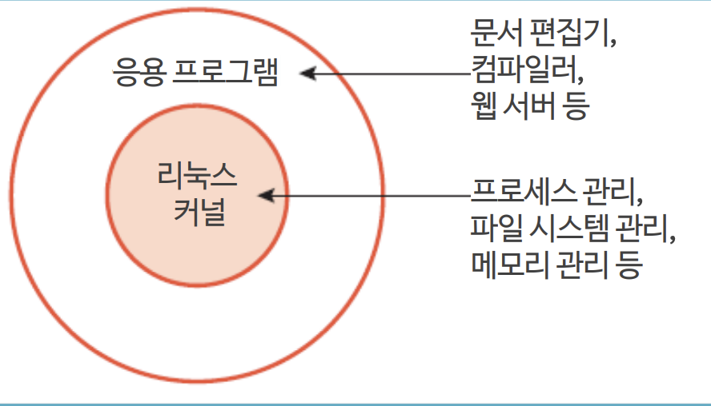

## 리눅스의 기초

---

#### 리눅스의 시작

- 핀란드 헬싱키대학교의 학생이던 **리눅스 베네딕트 토발스**가 개발

- **미닉스(MINIX)**라는 교육용 운영체제를 참조

- 리눅스 개발 소식을 comp.os.minix에 포스팅(1991.08.26 = 리눅스 탄생일)

#### 리눅스의 발전과정

- **GNU 프로젝트**: 리눅스 커널에 응용 프로그램 제공 -> GNU/리눅스
  
  

- 리눅스 재단: 2007년 설립
  
  - 리눅스 토르발스 지원
  
  - AT&T, 시스코, 화웨이, IBM, 인텔 등
  
  - 2005년 이래 7,800명이 넘는 개인 개발자 + 800여 개의 기업이 커널 개발에 공헌

#### GNU 프로젝트

- 리처드 스톨먼이 시작

- 1985년 [GNU 선언문](http://www.gnu.org/gnu/manifesto.html) 발표 및 자유소프트웨어재단(Free Software Foundation, FSF)을 설립

- GNU는 **유닉스와 호환**되는 **자유 소프트웨어**를 개발하는 포르젝트

- [GNU가 보장하는 4가지 자유](www.gnu.org)
  
  - 프로그램을 어떤 목적으로도 실행가능한 자유
  
  - 프로그램이 어떻게 동작하는지 학습, 자유롭게 개작할 수 있는 자유(소스 코드에 대한 접근 전재)
  
  - 이웃을 도울 수 있도록 복제물 재배포할 자유
  
  - 프로그램을 개선할 수 있는 자유와 개선된 이점을 공동체 전체가 누릴 수 있는 자유(소스 코드에 대한 접근 전재)

- 1989년에 GPL(GNU General Public License) 재정
  
  - 버전 1(GPLv1), 버전2(GPLv2), 버전3(GPLv3)
  
  - 컴퓨터 프로그램의 자유로운 사용, 무료 배포, 소스코드 변경 허용 등

#### 리눅스와 유닉스

- **리눅스**: 유닉스 계열의 운영체제
  
  

- 유닉스
  
  - 1969년 AT&T의 벨 연구소에서 **어셈블리어**로 처음 개발
  
  - 1971년에 C언어로 재개발 -> 최초의 **고급 프로그래밍 언어**로 작성한 운영체제
  
  - AT&T의 **상용 유닉스**와 오픈 소스 버전인 **BSD**로 나뉘어 발전
  
  - BSD는 AT&T의 라이선스가 필요 없는 **FreeBSD**로 발전

#### 리눅스 배포판

- 리눅스 커널 + 응용 프로그램으로 구성

- 레드햇 계열, 데비안 계열, 슬랙웨어 계열이 있음

- **주요 리눅스 배포판 계통도**
  
  

#### 우분투 리눅스

> 전 세계의 누구나 어렵지 않게 리눅스를 사용하자!

- 데비안 계열의 리눅스 최신 버전(17.10)

- 데비안 기반의 리눅스 중 가장 성공한 데스크톱 배포판

- 데비안 **GNU/리눅스**에 바탕

- **그놈**(GNOME)을 **기본 데스크톱 환경**으로 사용(11.04까진 **유니티**)

- 우분투 개발의 지휘자로 알려진 마크 셔틀워스가 세운 영국 캐노니컬의 지원

- 기본 시스템 도구 외에도 LibreOffice, 파이어폭스, 엠퍼시(메신저) 등 다양한 응용 소프트웨어도 함께 제공

- **우분투의 버전 관리**
  
  - 배포판이 나온 연도와 월로 구성: 17.10 -> 2017년 10월 배포
  
  - 처음 3개 버전 제외 6.06붜는 알파벳 순서로 만든 형용사 및 명사로 조합된 코드명 부여  

#### 리눅스의 특징

- 리눅스는 **공개 소프트웨어**이며 **무료**로 사용 가능

- 유닉스와의 **완벽한 호환성** 유지

- **서버용 운영체제**로 많이 사용됨

- 편리한 **GUI 환경** 제공

#### 리눅스의 구조

**커널**: 리눅스의 핵심

- 프로세스/메모리/파일 시스템/장치 관리

- 컴퓨터의 모든 자원 초기화 및 제어 기능

**쉘**: 사용자 인터페이스

- 명령 해석

- 프로그래밍 기능

- 리눅스 기본 셸 = 배시 셸(리눅스 셸)

**응용 프로그램**

- 각종 프로그래밍 개발 도구

- 문서 편집 도구

- 네트워크 관련 도구 등
